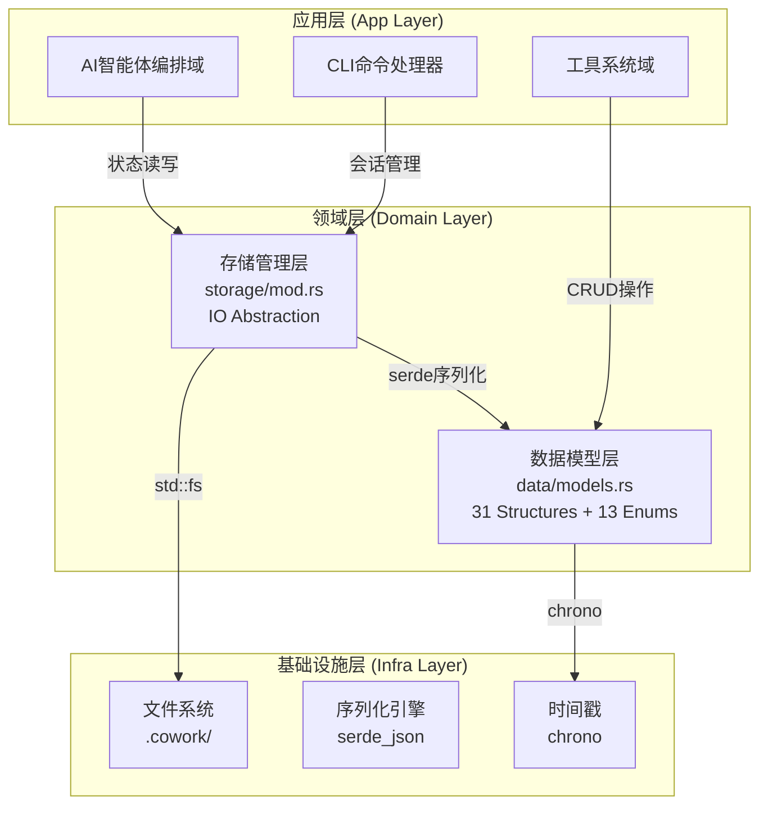
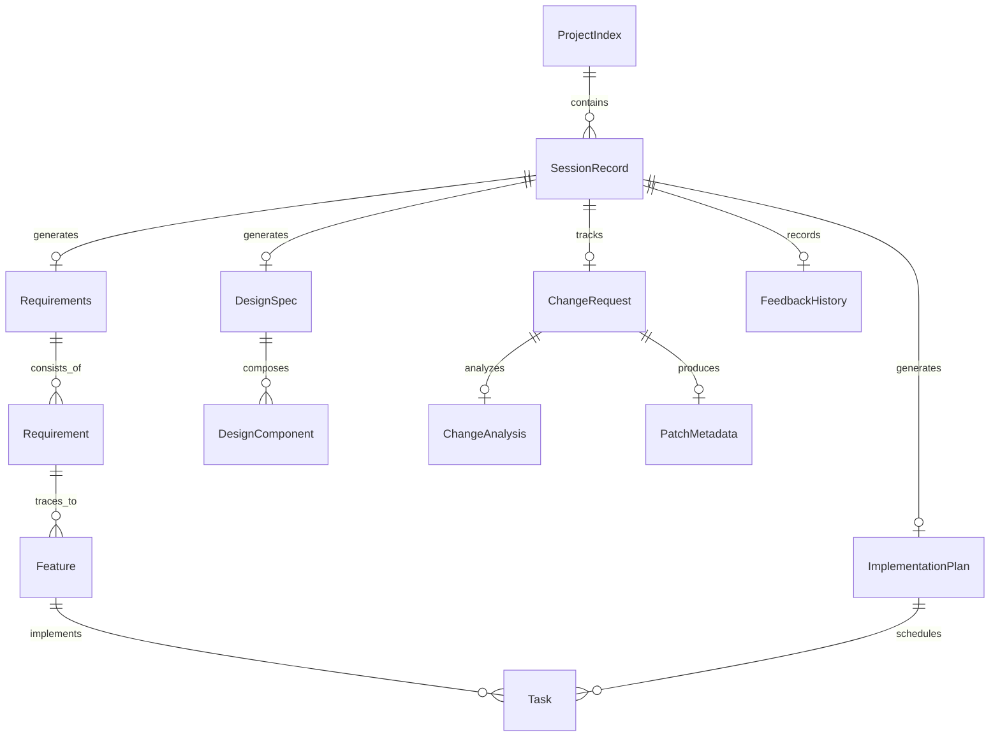

**数据与存储管理域技术文档**

---

## 1. 领域概述

### 1.1 定位与职责

**数据与存储管理域**是 Cowork Forge 系统的数据基础设施层，承担着软件开发生命周期（SDLC）全阶段数据的持久化、版本控制和状态管理职责。该域采用**文件系统原生持久化**架构，通过结构化的 JSON 文档和 Markdown 工件，实现 AI 智能体协作过程中的数据沉淀与可追溯性。

**核心职责：**
- **领域建模**：定义覆盖需求、设计、计划、代码、会话、变更六大领域的 31 个核心结构体与 13 个状态枚举
- **会话隔离**：实现基于 UUID 的会话作用域存储，支持多项目并行开发互不干扰
- **状态机管理**：维护 `InProgress` → `Completed`/`Failed` 的会话生命周期状态
- **变更追踪**：支持增量修改（Modify）和版本回退（Revert）时的状态继承与工件复制
- **工件持久化**：管理 `.cowork` 目录下的元数据、设计文档（PRD/Design）、任务清单等交付物

### 1.2 架构价值

在 Cowork Forge 的 Actor-Critic 多智能体协作架构中，本域充当**单一事实来源（Single Source of Truth）**：

| 价值维度 | 实现机制 | 业务收益 |
|---------|---------|---------|
| **可追溯性** | 会话级目录隔离 + 时间戳元数据 | 支持断点恢复（Resume）和故障排查 |
| **人机协作** | FeedbackHistory 持久化 | 保存用户审核意见，供 AI 迭代参考 |
| **安全容错** | 幂等读取模式（文件缺失返回默认值） | 避免工具调用因文件不存在而失败 |
| **增量演进** | `init_session_from_base` 继承机制 | 修改模式基于原会话快速分叉 |

---

## 2. 分层架构设计

数据与存储管理域采用**三层架构**实现关注点分离：



### 2.1 数据模型层（Data Models）

位于 `crates/cowork-core/src/data/models.rs`，采用**领域驱动设计（DDD）**范式，按 SDLC 阶段划分为六大子域：

**核心实体关系图：**



**关键数据结构：**

| 领域 | 核心结构体 | 职责说明 |
|------|-----------|---------|
| **需求管理** | `Requirements` / `Requirement` | 追踪需求条目、优先级、分类及验收标准 |
| **功能管理** | `Feature` / `FeatureList` | 管理功能生命周期（Planned→InProgress→Completed），支持自动状态流转 |
| **架构设计** | `DesignSpec` / `DesignComponent` | 存储简约架构约束（2-4 组件限制）、接口契约、数据模型 |
| **任务规划** | `ImplementationPlan` / `Task` | 维护 5-12 核心任务约束、依赖关系图、里程碑规划 |
| **代码元数据** | `CodeMetadata` / `FileMetadata` | 记录生成文件清单、构建状态、测试覆盖度 |
| **会话管理** | `SessionMeta` / `SessionRecord` | 管理会话类型（New/Modify/Revert）、状态机、父会话引用 |
| **变更管理** | `ChangeRequest` / `PatchMetadata` | 支持增量修改的影响范围分析、风险评级、工件更新追踪 |

### 2.2 存储管理层（Storage Layer）

位于 `crates/cowork-core/src/storage/mod.rs`，封装文件 IO 细节，提供**仓库模式（Repository Pattern）**抽象：

**存储拓扑结构：**

```
.cowork/
├── index.json                    # ProjectIndex: 项目级会话索引
└── sessions/
    └── {uuid}/
        ├── meta.json             # SessionMeta: 会话元数据
        ├── input.json            # 用户原始输入
        ├── change_request.json   # 变更请求（Modify模式）
        ├── state/
        │   ├── requirements.json
        │   ├── feature_list.json
        │   ├── design_spec.json
        │   ├── implementation_plan.json
        │   ├── code_metadata.json
        │   └── feedback_history.json
        ├── artifacts/
        │   ├── idea.md
        │   ├── prd.md
        │   ├── design.md
        │   └── plan.md
        └── patch/
            └── metadata.json     # PatchMetadata: 增量修改记录
```

---

## 3. 关键机制实现

### 3.1 会话生命周期管理

系统支持四种工作模式（New/Resume/Modify/Revert），存储层通过 `SessionType` 枚举和状态继承机制实现灵活切换：

**状态机定义：**
```rust
pub enum SessionStatus {
    InProgress,    // 执行中
    Completed,     // 已完成
    Failed,        // 失败/中止
}

pub enum SessionType {
    New,           // 全新创建
    Change,        // 增量修改（继承基线）
    Revert,        // 版本回退（继承基线）
}
```

**会话继承机制（Modify/Revert）：**

当执行 `cowork modify --project <name>` 时，存储层执行以下原子操作：

1. **基线复制**：通过 `init_session_from_base(new_id, base_id)` 将原会话的 `state/` 和 `artifacts/` 深拷贝到新会话目录
2. **元数据分叉**：新会话记录 `base_session_id` 指针，形成会话血缘链
3. **变更追踪**：创建 `ChangeRequest` 记录变更意图、影响范围（PRD/Design/Plan/Code）、风险等级

**会话恢复逻辑（Resume）：**

系统通过工件存在性检测自动推断恢复点，无需用户显式指定阶段：

```rust
// 伪代码示意
if exists(code_files) {
    resume_from = "check"
} else if exists(implementation_plan) && exists(design_spec) {
    resume_from = "coding"
} else if exists(design_spec) {
    resume_from = "plan"
} else if exists(requirements) {
    resume_from = "design"
} else {
    resume_from = "prd"
}
```

### 3.2 自动状态流转

存储层实现**状态机驱动**的自动化更新，减少智能体负担：

**功能状态自动推导：**

`update_feature_status_if_needed()` 方法基于关联任务的完成状态自动更新 `FeatureStatus`：

- 所有任务 Completed → Feature 标记为 Completed
- 任一任务 InProgress → Feature 标记为 InProgress
- 无任务关联 → 保持 Planned

**项目索引自动维护：**

当会话完成时，`mark_session_completed()` 自动更新 `ProjectIndex`：
- 将会话状态置为 `Completed`
- 更新 `latest_successful_session` 指针
- 记录完成时间戳

### 3.3 安全与容错设计

**Fail-Safe 读取模式：**

所有 `load_*()` 方法遵循**幂等性原则**：当文件不存在时返回结构体的 `Default` 实现，而非抛出错误。这确保 AI 工具在首次调用时不会因数据缺失而失败。

```rust
// 实现模式示例
pub fn load_requirements(session_id: &str) -> anyhow::Result<Requirements> {
    let path = get_state_path(session_id, "requirements.json");
    if !path.exists() {
        return Ok(Requirements::default()); // 空集合而非错误
    }
    let content = fs::read_to_string(path)?;
    Ok(serde_json::from_str(&content)?)
}
```

**原子写入：**

使用 `fs::write()` 进行单文件原子写入，配合 JSON 美化输出（`serde_json::to_string_pretty`）确保工件可读性，便于人工审核时直接查看 `.cowork` 目录内容。

---

## 4. 对外接口规范

### 4.1 存储层 API

存储管理层为上层领域提供以下能力接口：

**目录管理：**
- `get_cowork_dir() -> PathBuf`：获取项目级 .cowork 目录
- `get_session_dir(session_id: &str) -> PathBuf`：获取会话作用域目录

**项目级操作：**
- `load/save_project_index() -> ProjectIndex`：管理会话索引和最新成功会话指针

**会话生命周期：**
- `init_session(session_id: &str, input: SessionInput)`：初始化新会话目录结构
- `init_session_from_base(new_id: &str, base_id: &str) -> Result<()>`：基于现存会话创建分叉（Modify/Revert 模式）
- `mark_session_completed(session_id: &str)` / `mark_session_failed(session_id: &str)`：状态机转换

**数据持久化（按领域）：**
- `save/load_requirements()` / `save/load_design_spec()` / `save/load_implementation_plan()` / `save/load_code_metadata()`
- `save/load_session_meta()` / `save/load_feedback_history()`
- `save/load_change_request()`（Modify 模式专用）

**文档工件管理：**
- `save_idea_doc()` / `save_prd_doc()` / `save_design_doc()` / `save_plan_doc()`：存储 Markdown 格式设计文档

**智能辅助：**
- `update_feature_status_if_needed(session_id: &str) -> Result<bool>`：基于任务完成状态自动更新功能状态

### 4.2 数据模型构造器

关键结构体提供语义化构造器，确保数据完整性：

```rust
// 创建带唯一 ID 的变更请求
impl ChangeRequest {
    pub fn new(session_id: String, idea: String, base_session_id: String) -> Self {
        Self {
            id: format!("CHG-{}-{}", 
                chrono::Utc::now().timestamp(), 
                generate_short_id()
            ),
            session_id,
            base_session_id,
            idea,
            created_at: chrono::Utc::now(),
            // ... 其他字段默认值
        }
    }
}

// 项目索引初始化
impl ProjectIndex {
    pub fn new(project_name: String) -> Self {
        Self {
            project_name,
            sessions: Vec::new(),
            latest_successful_session: None,
            created_at: Utc::now(),
        }
    }
}
```

---

## 5. 与周边域的协作

数据与存储管理域作为基础设施层，通过**依赖注入**模式服务于上层业务域：

### 5.1 与 CLI 交互域的协作

**初始化阶段：**
- CLI 通过 `init_project_index()` 创建项目级索引
- 生成 UUID v4 作为 `session_id`，创建会话目录骨架

**命令执行阶段：**
- `cowork status`：读取 `ProjectIndex` 和 `SessionRecord` 展示项目历史
- `cowork resume`：基于存储层工件检测逻辑确定恢复点
- `cowork revert --to <stage>`：调用 `init_session_from_base()` 创建回退会话

### 5.2 与工具系统域的协作

工具系统通过存储层实现**数据操作工具集**（`data_tools.rs`）：

- **CreateRequirementTool**：调用 `save_requirements()` 持久化需求
- **UpdateTaskStatusTool**：更新任务后触发 `update_feature_status_if_needed()` 级联更新
- **SaveChangeRequestTool**：在 Modify 工作流中持久化变更分析结果

### 5.3 与 AI 智能体编排域的协作

智能体通过工具间接操作存储，实现**状态感知**的自主决策：

- **断点恢复**：`StageExecutor` 在管道编排时查询存储层工件存在性，动态构建执行计划
- **反馈循环**：`FeedbackHistory` 保存用户审核意见，供 `ResilientAgent` 在重试时加载上下文
- **变更分析**：`Change Triage Agent` 读取基线会话的 `DesignSpec` 和 `ImplementationPlan`，分析变更影响范围

---

## 6. 技术实现细节

### 6.1 技术栈选型

| 组件 | 选型 |  rationale |
|------|------|-----------|
| 序列化 | `serde` + `serde_json` | 零成本抽象，支持复杂嵌套结构 |
| 时间戳 | `chrono` | UTC 标准时间，ISO 8601 格式序列化 |
| 错误处理 | `anyhow` | 上下文丰富的错误传播，适配 ADK 框架 |
| 文件操作 | `std::fs` | 标准库原子操作，跨平台兼容 |

### 6.2 性能考量

**读写优化：**
- 采用**写时复制（COW）**策略：Modify/Revert 模式下仅复制必要的状态文件（平均 < 100KB），而非整个项目代码库
- JSON 美化输出增加可读性，牺牲少量存储空间（约 20% 膨胀率）换取人工审核便利

**并发控制：**
- 当前版本假设单用户 CLI 场景，暂无文件锁机制
- 幂等读取策略确保并发读取安全
- 建议后续演进引入 `fs2::FileLock` 防止多进程并发写入

### 6.3 扩展性设计

**新增数据结构：**
1. 在 `models.rs` 定义结构体，实现 `Serialize`/`Deserialize`
2. 在 `storage/mod.rs` 添加 `save/load_<new_type>()` 方法对
3. 更新 `SessionMeta` 或创建独立状态文件

**存储后端替换：**
当前基于文件系统的实现可通过以下方式演进为数据库存储：
- 抽象 `Storage` trait，隐藏具体持久化机制
- 实现 `DatabaseStorage` 适配器，替换文件操作
- 保持数据模型层不变，确保业务逻辑零侵入

---

## 7. 总结

数据与存储管理域作为 Cowork Forge 的**数据底座**，通过精简的文件系统持久化方案，实现了：

1. **会话隔离与可追溯**：UUID 作用域目录 + 项目索引，支撑多项目并行和断点恢复
2. **SDLC 全周期覆盖**：31 个核心结构体精确映射软件开发生命周期各阶段产物
3. **弹性容错**：Fail-Safe 读取模式与状态继承机制，确保 AI 协作流程的健壮性
4. **变更原生支持**：ChangeRequest + PatchMetadata 为增量修改提供数据支撑

该域的设计遵循**简约优先**原则，避免引入重型数据库依赖，利用现代文件系统性能和 JSON 可读性，在 CLI 工具场景下实现了开发效率与可维护性的最佳平衡。