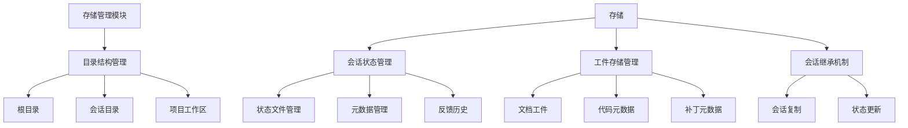

# Cowork Forge 数据存储域技术文档

## 1. 模块概述

数据存储域是 Cowork Forge 系统的核心基础设施模块，负责所有项目数据的持久化存储和状态管理。该模块采用基于文件的存储架构，实现了完整的会话隔离机制，支持软件开发生命周期的全过程数据管理。

### 1.1 核心职责
- **数据持久化**：实现项目元数据、会话状态、开发工件的文件存储
- **会话管理**：提供会话隔离的目录结构和状态跟踪
- **状态同步**：支持功能状态自动更新和会话继承机制
- **数据验证**：通过结构化数据模型确保数据完整性

### 1.2 技术架构


## 2. 核心架构设计

### 2.1 分层目录结构

数据存储域采用标准化的分层目录结构，确保数据隔离和版本管理：

```
.cowork/                          # 项目根目录
├── index.json                    # 项目索引文件
├── sessions/                     # 会话隔离目录
│   └── <session_id>/            # 特定会话目录
│       ├── input.json           # 会话输入配置
│       ├── artifacts/           # 文档工件目录
│       │   ├── idea.md          # 项目构思文档
│       │   ├── prd.md           # 产品需求文档
│       │   ├── design.md        # 设计文档
│       │   └── delivery_report.md # 交付报告
│       ├── state/               # 状态数据目录
│       │   ├── requirements.json    # 需求规范
│       │   ├── feature_list.json    # 功能列表
│       │   ├── design_spec.json     # 设计规范
│       │   ├── implementation_plan.json # 实现计划
│       │   ├── code_metadata.json   # 代码元数据
│       │   ├── feedback.json        # 反馈历史
│       │   └── meta.json            # 会话元数据
│       ├── patch/               # 补丁数据目录
│       │   └── metadata.json    # 补丁元数据
│       └── logs/                # 日志文件目录
└── project_root/                # 实际代码工作区（外部关联）
```

### 2.2 会话隔离架构

每个会话拥有独立的存储空间，确保不同开发阶段的数据隔离：

```rust
// 会话目录管理函数
pub fn get_session_dir(session_id: &str) -> Result<PathBuf> {
    let cowork_dir = get_cowork_dir()?;
    let session_path = cowork_dir.join(SESSIONS_DIR).join(session_id);
    
    // 创建标准化的子目录结构
    fs::create_dir_all(&session_path)?;
    fs::create_dir_all(session_path.join("artifacts"))?;
    fs::create_dir_all(session_path.join("state"))?;
    fs::create_dir_all(session_path.join("patch"))?;
    fs::create_dir_all(session_path.join("logs"))?;
    
    Ok(session_path)
}
```

## 3. 核心功能模块

### 3.1 项目索引管理

项目索引文件（`index.json`）作为系统的入口点，跟踪所有会话记录：

```rust
#[derive(Debug, Clone, Serialize, Deserialize)]
pub struct ProjectIndex {
    pub schema_version: String,
    pub project_name: String,
    pub created_at: DateTime<Utc>,
    pub updated_at: DateTime<Utc>,
    pub latest_successful_session: Option<String>, // 用于修改会话的基础
    pub sessions: Vec<SessionRecord>, // 所有会话记录
}
```

**主要操作函数：**
- `save_project_index()` - 保存项目索引
- `load_project_index()` - 加载项目索引  
- `init_project_index()` - 初始化新项目
- `mark_session_completed()` - 标记会话完成状态

### 3.2 状态文件管理

状态文件存储开发过程中的结构化数据，采用 JSON 格式进行序列化：

```rust
// 状态文件路径管理
fn state_path(session_id: &str, filename: &str) -> Result<PathBuf> {
    let session_dir = get_session_dir(session_id)?;
    Ok(session_dir.join("state").join(filename))
}

// 状态文件存在性检查
pub fn state_file_exists(session_id: &str, filename: &str) -> Result<bool> {
    Ok(state_path(session_id, filename)?.exists())
}

// 具体状态文件操作
pub fn save_requirements(session_id: &str, requirements: &Requirements) -> Result<()>
pub fn load_requirements(session_id: &str) -> Result<Requirements>
```

**支持的状态文件类型：**
- 需求规范 (`requirements.json`)
- 功能列表 (`feature_list.json`) 
- 设计规范 (`design_spec.json`)
- 实现计划 (`implementation_plan.json`)
- 代码元数据 (`code_metadata.json`)
- 反馈历史 (`feedback.json`)
- 会话元数据 (`meta.json`)

### 3.3 工件存储管理

文档工件以 Markdown 格式存储，支持版本控制和人工审查：

```rust
// 工件文件路径管理
fn artifact_path(session_id: &str, filename: &str) -> Result<PathBuf> {
    let session_dir = get_session_dir(session_id)?;
    Ok(session_dir.join("artifacts").join(filename))
}

// 工件文件操作
pub fn save_idea(session_id: &str, content: &str) -> Result<()>
pub fn save_prd_doc(session_id: &str, content: &str) -> Result<()>
pub fn save_design_doc(session_id: &str, content: &str) -> Result<()>
pub fn save_delivery_report(session_id: &str, content: &str) -> Result<()>
```

### 3.4 会话继承机制

支持增量修改和阶段重入的会话继承功能：

```rust
/// 从基础会话初始化新会话
pub fn init_session_from_base(new_session_id: &str, base_session_id: &str) -> Result<()> {
    let base_dir = get_session_dir(base_session_id)?;
    let new_dir = get_session_dir(new_session_id)?;

    // 复制状态文件
    let state_files = ["requirements.json", "feature_list.json", "design_spec.json", ...];
    for name in state_files {
        let src = base_dir.join("state").join(name);
        let dst = new_dir.join("state").join(name);
        copy_if_exists(&src, &dst)?;
    }

    // 复制工件文件
    let artifact_files = ["idea.md", "prd.md", "design.md", "delivery_report.md"];
    for name in artifact_files {
        let src = base_dir.join("artifacts").join(name);
        let dst = new_dir.join("artifacts").join(name);
        copy_if_exists(&src, &dst)?;
    }

    Ok(())
}
```

## 4. 数据模型设计

### 4.1 核心数据结构

数据存储域定义了完整的软件开发数据结构模型：

```rust
// 需求规范数据结构
#[derive(Debug, Clone, Serialize, Deserialize)]
pub struct Requirements {
    pub schema_version: String,
    pub created_at: DateTime<Utc>,
    pub updated_at: DateTime<Utc>,
    pub requirements: Vec<Requirement>,
}

// 功能列表数据结构  
#[derive(Debug, Clone, Serialize, Deserialize)]
pub struct FeatureList {
    pub schema_version: String,
    pub features: Vec<Feature>,
}

// 设计规范数据结构
#[derive(Debug, Clone, Serialize, Deserialize)]
pub struct DesignSpec {
    pub schema_version: String,
    pub architecture: Architecture,
    pub technology_stack: TechnologyStack,
    pub deployment: DeploymentInfo,
}

// 实现计划数据结构
#[derive(Debug, Clone, Serialize, Deserialize)]
pub struct ImplementationPlan {
    pub schema_version: String,
    pub milestones: Vec<Milestone>,
    pub tasks: Vec<Task>,
}
```

### 4.2 状态枚举定义

系统定义了完整的状态枚举，支持开发流程的精确控制：

```rust
// 功能状态枚举
#[derive(Debug, Clone, Copy, Serialize, Deserialize, PartialEq, Eq)]
pub enum FeatureStatus {
    Pending,
    InProgress,
    Completed,
    Blocked,
}

// 任务状态枚举
#[derive(Debug, Clone, Copy, Serialize, Deserialize, PartialEq, Eq)]
pub enum TaskStatus {
    Pending,
    InProgress,
    Completed,
    Blocked,
}

// 会话类型枚举
#[derive(Debug, Clone, Copy, Serialize, Deserialize, PartialEq, Eq)]
pub enum SessionType {
    New,      // 完整项目创建
    Modify,   // 增量修改
    Revert,   // 回滚重运行
}
```

## 5. 核心业务逻辑

### 5.1 自动化状态更新

系统实现了基于任务完成状态的自动化功能状态更新：

```rust
/// 基于任务完成状态更新功能状态
pub fn update_feature_status_if_needed(session_id: &str, feature_id: &str) -> Result<()> {
    let plan = load_implementation_plan(session_id)?;
    let mut features = load_feature_list(session_id)?;
    
    // 获取功能相关任务
    let feature_tasks: Vec<&Task> = plan.tasks.iter()
        .filter(|t| t.feature_id == feature_id)
        .collect();
    
    // 分析任务状态
    let all_completed = feature_tasks.iter().all(|t| t.status == TaskStatus::Completed);
    let any_in_progress = feature_tasks.iter().any(|t| t.status == TaskStatus::InProgress);
    let any_blocked = feature_tasks.iter().any(|t| t.status == TaskStatus::Blocked);
    
    // 确定新状态
    let new_status = if all_completed {
        FeatureStatus::Completed
    } else if any_blocked {
        FeatureStatus::Blocked
    } else if any_in_progress {
        FeatureStatus::InProgress
    } else {
        FeatureStatus::Pending
    };
    
    // 更新功能状态
    let feature = &mut features.features[feature_idx];
    if feature.status != new_status {
        feature.status = new_status;
        save_feature_list(session_id, &features)?;
    }
    
    Ok(())
}
```

### 5.2 变更请求管理

支持增量修改的变更请求数据模型：

```rust
#[derive(Debug, Clone, Serialize, Deserialize)]
pub struct ChangeRequest {
    pub id: String,
    pub session_id: String,
    pub created_at: DateTime<Utc>,
    pub idea: String,                    // 用户变更描述
    pub base_session_id: String,         // 基础会话ID
    pub scope: ChangeScope,              // 变更范围分析
    pub acceptance_criteria: Vec<String>, // 验收标准
    pub constraints: Vec<String>,        // 约束条件
    pub analysis: Option<ChangeAnalysis>, // 变更分析结果
}
```

## 6. 错误处理与数据完整性

### 6.1 错误处理机制

采用 `anyhow` 库提供上下文丰富的错误处理：

```rust
pub fn load_project_index() -> Result<ProjectIndex> {
    let path = PathBuf::from(COWORK_DIR).join(INDEX_FILE);
    if !path.exists() {
        anyhow::bail!("Project not initialized. Run 'cowork new' first.");
    }
    let content = fs::read_to_string(&path)
        .with_context(|| format!("Failed to read {:?}", path))?;
    let index: ProjectIndex = serde_json::from_str(&content)
        .with_context(|| "Failed to parse index.json")?;
    Ok(index)
}
```

### 6.2 数据完整性保障

- **文件存在性检查**：所有加载操作前检查文件存在性
- **默认值处理**：文件不存在时返回合理的默认值
- **序列化验证**：通过 Serde 确保 JSON 格式正确性
- **版本控制**：数据结构包含 schema_version 字段支持向后兼容

## 7. 性能与扩展性考虑

### 7.1 性能优化

- **异步操作支持**：文件操作可轻松扩展为异步实现
- **增量读写**：支持大文件的增量读写操作
- **缓存机制**：可扩展为内存缓存减少文件 I/O

### 7.2 扩展性设计

- **插件化架构**：支持不同的存储后端（如数据库、云存储）
- **配置化路径**：存储路径可通过配置灵活调整
- **模块化设计**：各功能模块独立，便于维护和扩展

## 8. 总结

数据存储域作为 Cowork Forge 系统的核心基础设施，提供了可靠、高效的数据持久化解决方案。通过会话隔离的目录架构、完整的数据模型定义和智能的状态管理机制，系统能够支持复杂的软件开发生命周期管理需求。模块的设计体现了现代软件工程的最佳实践，为系统的稳定运行和功能扩展奠定了坚实基础。