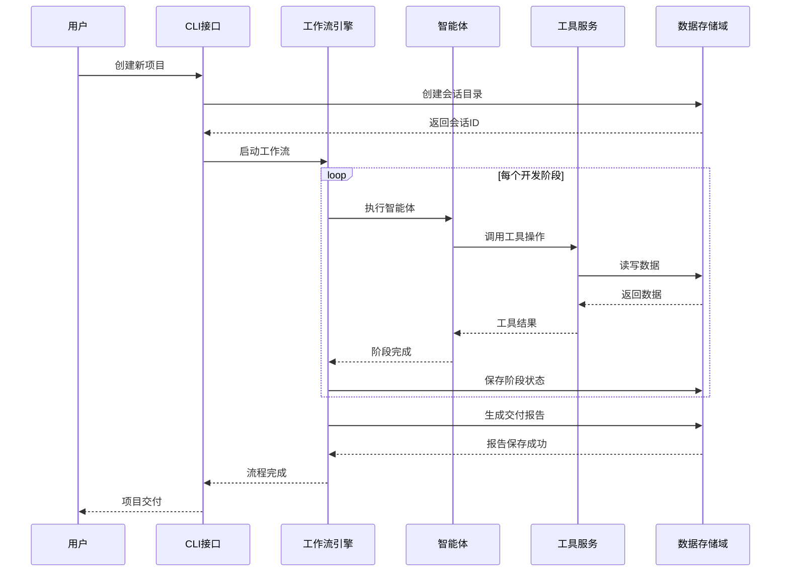

# 数据存储域技术文档

## 模块概述

数据存储域是Cowork Forge系统的核心基础设施域，负责项目数据的持久化存储和会话管理。该模块采用文件系统级持久化方案，为整个AI辅助开发工作流提供可靠的数据存储和状态管理能力。

**生成时间：** 2026-01-30 14:00:15 (UTC)  
**时间戳：** 1769781615

## 架构定位

### 在系统架构中的位置
数据存储域位于系统架构的数据层，属于基础设施域类型，为上层业务域提供数据持久化支持：
- **上游依赖**：工具服务域、工作流引擎域
- **下游服务**：应用接口域、工作流引擎域
- **重要性评分**：8.0/10.0
- **复杂度评分**：7.5/10.0

### 核心职责
1. **会话管理**：项目会话的创建、保存、加载和恢复
2. **数据持久化**：开发过程中各类数据的序列化和存储
3. **状态管理**：工作流执行状态的跟踪和持久化
4. **工件管理**：交付报告、设计文档等工件的保存和加载

## 模块组成

### 1. 会话存储模块
**代码路径：** `crates/cowork-core/src/storage/mod.rs`  
**重要性：** 9.0/10.0

#### 核心功能
- **项目索引管理**：维护`.cowork/index.json`项目索引文件
- **会话目录结构**：管理`sessions/<id>/`分层目录结构
- **状态文件持久化**：序列化保存`state/*.json`状态文件
- **会话继承复制**：支持会话状态的复制和继承机制

#### 关键函数
```rust
// 会话CRUD操作
pub fn create_session(project_id: &str) -> Result<Session>
pub fn load_session(session_id: &str) -> Result<Session>
pub fn save_session(session: &Session) -> Result<()>
pub fn delete_session(session_id: &str) -> Result<()>

// 会话继承
pub fn inherit_session(parent_session_id: &str, new_session_id: &str) -> Result<Session>
```

### 2. 数据模型模块
**代码路径：** `crates/cowork-core/src/data/models.rs`  
**重要性：** 8.0/10.0

#### 核心数据结构
- **需求模型**：产品需求文档的数据结构定义
- **特性模型**：功能特性的数据结构和关系定义
- **设计模型**：系统架构设计的数据表示
- **任务模型**：开发任务和依赖关系的数据模型
- **会话模型**：会话状态和元数据的完整定义

#### 序列化支持
```rust
#[derive(Serialize, Deserialize, Clone, Debug)]
pub struct Session {
    pub id: String,
    pub project_id: String,
    pub created_at: DateTime<Utc>,
    pub current_stage: WorkflowStage,
    pub requirements: Vec<Requirement>,
    pub features: Vec<Feature>,
    pub designs: Vec<Design>,
    pub tasks: Vec<Task>,
}
```

### 3. 工件工具模块
**代码路径：** `crates/cowork-core/src/tools/artifact_tools.rs`  
**重要性：** 7.0/10.0

#### 工具功能
- **交付报告工具**：`SaveDeliveryReportTool` - 保存`delivery_report.md`
- **PRD文档工具**：`SavePrdDocTool` - 保存`prd.md`需求文档
- **设计文档工具**：`SaveDesignDocTool` - 保存`design.md`设计文档
- **反馈历史工具**：`LoadFeedbackHistoryTool` - 加载`feedback.json`反馈记录

## 技术实现

### 存储架构设计
```
.cowork/
├── index.json              # 项目索引文件
└── sessions/               # 会话目录
    └── <session_id>/       # 会话专属目录
        ├── state/          # 状态文件目录
        │   ├── requirements.json
        │   ├── features.json
        │   ├── designs.json
        │   └── tasks.json
        └── artifacts/      # 工件文件目录
            ├── prd.md
            ├── design.md
            ├── delivery_report.md
            └── feedback.json
```

### 核心实现特性

#### 1. 异步文件操作
```rust
impl SessionStorage {
    pub async fn save_state(&self, state: &SessionState) -> Result<()> {
        let json_data = serde_json::to_string_pretty(state)?;
        tokio::fs::write(&self.state_path, json_data).await?;
        Ok(())
    }
    
    pub async fn load_state(&self) -> Result<SessionState> {
        let json_data = tokio::fs::read_to_string(&self.state_path).await?;
        let state: SessionState = serde_json::from_str(&json_data)?;
        Ok(state)
    }
}
```

#### 2. 错误处理机制
```rust
pub enum StorageError {
    IoError(std::io::Error),
    SerializationError(serde_json::Error),
    SessionNotFound(String),
    InvalidSessionState(String),
    PermissionDenied(String),
}

impl From<std::io::Error> for StorageError {
    fn from(error: std::io::Error) -> Self {
        StorageError::IoError(error)
    }
}
```

#### 3. 并发安全设计
```rust
pub struct ConcurrentSessionManager {
    sessions: Arc<RwLock<HashMap<String, SessionHandle>>>,
    base_path: PathBuf,
}

impl ConcurrentSessionManager {
    pub async fn get_session(&self, session_id: &str) -> Result<SessionHandle> {
        let sessions = self.sessions.read().await;
        sessions.get(session_id)
            .cloned()
            .ok_or_else(|| StorageError::SessionNotFound(session_id.to_string()))
    }
}
```

## 工作流集成

### 在完整项目开发流程中的角色


### 项目恢复流程支持
```rust
pub async fn resume_project(session_id: &str, target_stage: WorkflowStage) -> Result<()> {
    // 1. 加载会话状态
    let session = storage::load_session(session_id).await?;
    
    // 2. 验证数据完整性
    validate_session_integrity(&session)?;
    
    // 3. 创建部分工作流
    let partial_pipeline = create_partial_pipeline(session, target_stage);
    
    // 4. 从指定阶段继续执行
    partial_pipeline.execute().await
}
```

## 性能优化策略

### 1. 懒加载机制
```rust
pub struct LazySessionData {
    session_id: String,
    requirements: OnceCell<Vec<Requirement>>,
    features: OnceCell<Vec<Feature>>,
    designs: OnceCell<Vec<Design>>,
}

impl LazySessionData {
    pub async fn get_requirements(&self) -> Result<&Vec<Requirement>> {
        self.requirements.get_or_try_init(|| {
            async {
                storage::load_requirements(&self.session_id).await
            }
        }).await
    }
}
```

### 2. 增量保存策略
```rust
pub struct IncrementalSaver {
    session_id: String,
    dirty_flags: HashMap<String, bool>,
    save_queue: mpsc::UnboundedSender<SaveTask>,
}

impl IncrementalSaver {
    pub fn mark_dirty(&mut self, data_type: &str) {
        self.dirty_flags.insert(data_type.to_string(), true);
    }
    
    pub async fn save_if_dirty(&mut self) -> Result<()> {
        for (data_type, dirty) in &self.dirty_flags {
            if *dirty {
                self.save_data(data_type).await?;
                self.dirty_flags.insert(data_type.clone(), false);
            }
        }
        Ok(())
    }
}
```

## 容错与可靠性

### 1. 数据完整性校验
```rust
pub fn validate_session_integrity(session: &Session) -> Result<()> {
    // 检查必需文件存在性
    let required_files = [
        "state/requirements.json",
        "state/features.json", 
        "state/designs.json",
        "state/tasks.json"
    ];
    
    for file in &required_files {
        if !session.path.join(file).exists() {
            return Err(StorageError::InvalidSessionState(
                format!("Missing required file: {}", file)
            ));
        }
    }
    
    // 验证数据一致性
    validate_data_consistency(session)?;
    
    Ok(())
}
```

### 2. 备份和恢复机制
```rust
pub struct SessionBackup {
    base_path: PathBuf,
    backup_dir: PathBuf,
}

impl SessionBackup {
    pub async fn create_backup(&self, session_id: &str) -> Result<String> {
        let backup_id = format!("{}_{}", session_id, Utc::now().timestamp());
        let backup_path = self.backup_dir.join(&backup_id);
        
        // 使用原子操作创建备份
        atomic_copy(&self.base_path.join(session_id), &backup_path).await?;
        
        Ok(backup_id)
    }
    
    pub async fn restore_backup(&self, backup_id: &str, target_session_id: &str) -> Result<()> {
        let backup_path = self.backup_dir.join(backup_id);
        let target_path = self.base_path.join(target_session_id);
        
        // 原子性恢复操作
        atomic_restore(&backup_path, &target_path).await?;
        
        Ok(())
    }
}
```

## 最佳实践指南

### 1. 会话管理最佳实践
```rust
// 正确用法：使用会话管理器进行生命周期管理
let session_manager = SessionManager::new(project_path);
let session = session_manager.create_session().await?;

// 在执行关键操作前保存状态
session_manager.save_checkpoint(&session).await?;

// 操作完成后确认保存
session_manager.finalize_session(&session).await?;
```

### 2. 错误处理模式
```rust
// 使用组合错误处理
async fn save_project_data(session: &Session, data: &ProjectData) -> Result<()> {
    // 尝试保存主要数据
    let result = storage::save_requirements(&session.id, &data.requirements).await;
    
    match result {
        Ok(_) => {
            // 成功后保存元数据
            storage::update_session_metadata(session).await?;
            Ok(())
        }
        Err(e) => {
            // 失败时记录错误并尝试回滚
            error!("Failed to save requirements: {}", e);
            storage::mark_session_as_inconsistent(&session.id).await?;
            Err(e)
        }
    }
}
```

## 监控和调试

### 1. 存储操作监控
```rust
#[derive(Debug)]
pub struct StorageMetrics {
    pub read_operations: AtomicU64,
    pub write_operations: AtomicU64,
    pub total_data_size: AtomicU64,
    pub average_latency: AtomicU64,
}

impl StorageMetrics {
    pub fn record_read(&self, size: u64, latency: Duration) {
        self.read_operations.fetch_add(1, Ordering::Relaxed);
        self.total_data_size.fetch_add(size, Ordering::Relaxed);
        // 更新平均延迟
    }
}
```

### 2. 调试工具支持
```rust
pub struct StorageDebugger {
    session_id: String,
    debug_log: Vec<StorageEvent>,
}

#[derive(Debug)]
pub enum StorageEvent {
    FileRead { path: String, size: u64 },
    FileWrite { path: String, size: u64 },
    SessionCreated { session_id: String },
    SessionLoaded { session_id: String },
}

impl StorageDebugger {
    pub fn log_event(&mut self, event: StorageEvent) {
        self.debug_log.push(event);
        // 可选：写入调试日志文件
    }
}
```

## 总结

数据存储域作为Cowork Forge系统的核心基础设施，通过模块化的设计和可靠的技术实现，为AI辅助开发工作流提供了强大的数据持久化支持。该模块的会话管理、数据模型和工件工具三个子模块协同工作，确保了系统在各种工作流场景下的数据一致性和可靠性。

模块采用Rust语言实现，充分利用了其内存安全性和并发性能优势，结合异步文件操作和错误处理机制，为上层业务域提供了高效、可靠的数据存储服务。