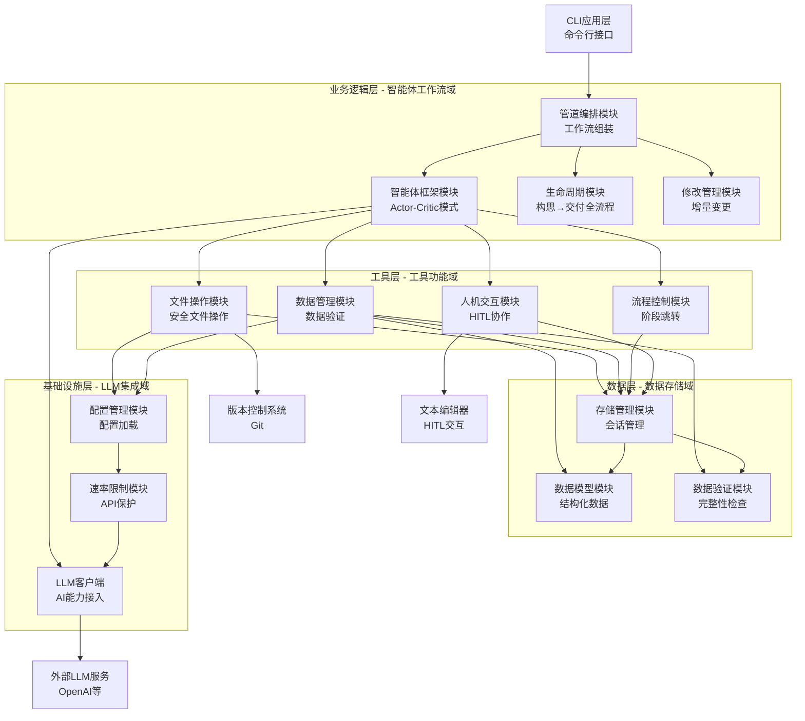

# Cowork Forge 智能体工作流域技术文档

## 模块概述

智能体工作流域是Cowork Forge系统的核心业务域，负责软件开发生命周期的核心工作流编排。该模块采用基于Actor-Critic模式的多智能体协作框架，实现从项目构思到交付的全流程自动化管理。

## 架构设计

### 1. 模块分层结构

智能体工作流域采用分层设计，包含以下核心组件：



### 2. 核心组件架构

#### 2.1 管道编排模块
**定位**: `crates/cowork-core/src/pipeline/mod.rs`
**功能**: 负责组装不同智能体组合形成完整或部分工作流
**核心功能**:
- `create_cowork_pipeline()` - 全项目创建管道
- `create_resume_pipeline()` - 阶段重入管道  
- `create_partial_pipeline()` - 部分工作流组装
- `create_modify_pipeline()` - 增量修改管道

#### 2.2 智能体框架模块
**定位**: `crates/cowork-core/src/agents/mod.rs`
**功能**: 提供多智能体协作框架和错误恢复机制
**核心特性**:
- Actor-Critic模式实现
- Human-in-the-Loop错误恢复机制
- Session隔离的架构设计
- 增量修改和阶段重入支持

## 技术实现细节

### 3. Actor-Critic模式实现

#### 3.1 智能体协作策略

```rust
// Actor-Critic协作模式示例
pub fn create_prd_loop(model: Arc<dyn Llm>, session_id: &str) -> Result<Arc<dyn Agent>> {
    // Actor智能体生成内容
    let prd_actor = LlmAgentBuilder::new("prd_actor")
        .instruction(PRD_ACTOR_INSTRUCTION)
        .model(model.clone())
        .tool(Arc::new(CreateRequirementTool::new(session.clone())))
        .build()?;

    // Critic智能体审查内容
    let prd_critic = LlmAgentBuilder::new("prd_critic")
        .instruction(PRD_CRITIC_INSTRUCTION)
        .model(model)
        .tool(Arc::new(ProvideFeedbackTool::new(session.clone())))
        .build()?;

    // LoopAgent包装Actor和Critic角色
    let mut loop_agent = LoopAgent::new("prd_loop", 
        vec![Arc::new(prd_actor), Arc::new(prd_critic)]);
    loop_agent = loop_agent.with_max_iterations(3); // 最多3次迭代
}
```

#### 3.2 错误恢复机制

**ResilientAgent设计**:
- 通过`ResilientAgent`包装`LoopAgent`实现错误拦截
- 采用`max_iterations=1`替代`exit_loop()`避免管道终止
- 支持用户干预的错误恢复流程

### 4. 工作流编排策略

#### 4.1 管道类型管理

**全项目创建管道**:
```rust
pub fn create_cowork_pipeline(config: &ModelConfig, session_id: &str) -> Result<Arc<dyn Agent>> {
    // IdeaAgent → PRD Loop → Design Loop → Plan Loop → Coding Loop → Check → Delivery
    let agents = vec![
        create_idea_agent(),
        create_prd_loop(),
        create_design_loop(),
        create_plan_loop(),
        create_coding_loop(),
        create_check_agent(),
        create_delivery_agent()
    ];
    SequentialAgent::new("cowork_forge_pipeline", agents)
}
```

#### 4.2 阶段重入机制

**文件状态检测逻辑**:
```rust
pub fn create_resume_pipeline(config: &ModelConfig, session_id: &str, base_session_id: &str) -> Result<Arc<dyn Agent>> {
    // 从最先进的阶段向最早阶段检测
    let start_stage = if has_code_files(base_session_id)? {
        "check" // 代码文件存在 → Coding阶段完成，从Check阶段继续
    } else if has_implementation_plan(base_session_id)? && has_design_spec(base_session_id)? && has_requirements(base_session_id)? {
        "coding" // PRD、设计、计划存在但无代码文件 → 从Coding阶段继续
    } else if has_design_spec(base_session_id)? && has_requirements(base_session_id)? {
        "plan" // PRD、设计存在 → 从Plan阶段继续
    } else if has_requirements(base_session_id)? {
        "design" // PRD存在 → 从Design阶段继续
    } else {
        "prd" // 无任何文件或只有idea.md → 从PRD阶段开始
    };
}
```

#### 4.3 增量修改支持

**增量修改管道**:
```rust
pub fn create_modify_pipeline(config: &ModelConfig, session_id: &str, base_session_id: &str) -> Result<Arc<dyn Agent>> {
    // 增量修改流程：Change Triage → Artifact Patch → Code Patch → Check → Delivery
    let agents = vec![
        create_change_triage_agent(),
        create_code_patch_agent(),
        create_check_agent(),
        create_modify_delivery_agent()
    ];
    SequentialAgent::new(format!("modify_pipeline_{}", session_id), agents)
}
```

### 5. 会话隔离架构

#### 5.1 会话管理机制

**会话隔离设计**:
- 每个项目拥有独立的会话ID
- 基于会话ID的文件路径隔离
- 支持多项目并行开发
- 确保数据安全性和隔离性

#### 5.2 会话状态追踪

**状态检测算法**:
```rust
fn determine_resume_stage(base_session_id: &str) -> Result<&str> {
    // 从最先进的阶段向最早阶段检测
    if has_code_files(base_session_id)? {
        "check" // 代码文件存在 → Coding阶段完成，从Check阶段继续
    } else if has_implementation_plan(base_session_id)? 
        && has_design_spec(base_session_id)? 
        && has_requirements(base_session_id)? {
        "coding" // PRD、设计、计划存在但无代码文件 → 从Coding阶段继续
    } else if has_design_spec(base_session_id)? && has_requirements(base_session_id)? {
        "plan" // PRD、设计存在 → 从Plan阶段继续
    } else if has_requirements(base_session_id)? {
        "design" // PRD存在 → 从Design阶段继续
    } else {
        "prd" // 无任何文件或只有idea.md → 从PRD阶段开始
    }
}
```

## 工作流执行模式

### 6. 核心交互模式

#### 6.1 工作流执行模式
```
CLI命令 → 会话管理 → 管道编排 → 智能体执行 → 工具调用 → 数据持久化
```

#### 6.2 智能体协作模式
```
Actor智能体生成内容 → Critic智能体审查 → HITL人工干预(可选) → 迭代优化
```

#### 6.3 数据流模式
```
用户输入 → 会话状态管理 → 智能体处理 → 工具操作 → 文件持久化 → 交付报告
```

### 7. 架构特点分析

#### 7.1 分层解耦优势
- 清晰的层级职责划分
- 接口驱动的模块间通信
- 降低模块间耦合度

#### 7.2 模块化设计优势
- 支持独立开发和测试
- 便于系统维护和功能扩展
- 模块化错误隔离机制

#### 7.3 会话隔离特点
- 基于会话ID的项目隔离
- 支持多项目并行开发
- 版本管理和数据安全性

## 技术实现详解

### 8. 管道编排核心实现

#### 8.1 全项目创建管道
```rust
pub fn create_cowork_pipeline(config: &ModelConfig, session_id: &str) -> Result<Arc<dyn Agent>> {
    // 创建LLM客户端
    let llm = create_llm_client(&config.llm)?;

    // 创建包含全生命周期的智能体序列
    let agents = vec![
        create_idea_agent(llm.clone(), session_id)?,
        create_prd_loop(llm.clone(), session_id)? as Arc<dyn Agent>,
        create_design_loop(llm.clone(), session_id)?,
        create_plan_loop(llm.clone(), session_id)?,
        create_coding_loop(llm.clone(), session_id)?,
        create_check_agent(llm.clone(), session_id)?,
        create_delivery_agent(llm, session_id)?
    ];

    // 组装为SequentialAgent
    let pipeline = SequentialAgent::new(
        "cowork_forge_pipeline",
        agents,
    );
}
```

#### 8.2 阶段重入管道
```rust
pub fn create_resume_pipeline(config: &ModelConfig, session_id: &str, base_session_id: &str) -> Result<Arc<dyn Agent>> {
    // 基于基础会话的文件状态检测
    let start_stage = if has_code_files(base_session_id)? {
        "check" // 代码文件存在 → Coding完成，从Check开始
    } else if has_implementation_plan(base_session_id)? && has_design_spec(base_session_id)? && has_requirements(base_session_id)? {
        "coding" // PRD、设计、计划存在但无代码文件 → 从Coding开始
    } else if has_design_spec(base_session_id)? && has_requirements(base_session_id)? {
        "plan" // PRD、设计存在 → 从Plan开始
    } else if has_requirements(base_session_id)? {
        "design" // PRD存在 → 从Design开始
    } else {
        "prd" // 无任何文件或只有idea.md → 从PRD开始
    };
}
```

### 9. 增量修改支持机制

#### 9.1 修改管理模块
```rust
pub fn create_modify_pipeline(config: &ModelConfig, session_id: &str, base_session_id: &str) -> Result<Arc<dyn Agent>> {
    // 增量修改流程：变更分析 → 工件补丁 → 代码补丁 → 验证 → 交付报告
    let agents = vec![
        create_change_triage_agent(llm.clone(), session_id, base_session_id)?,
        create_code_patch_agent(llm.clone(), session_id, base_session_id)?,
        create_check_agent(llm.clone(), session_id)?,
        create_modify_delivery_agent(llm, session_id, base_session_id)?
    ];
}
```

## 总结

智能体工作流域通过多智能体协作的Actor-Critic模式，实现了软件开发生命周期的自动化管理。该模块的核心价值在于：

1. **全流程自动化**: 支持从构思到交付的完整生命周期管理
2. **增量修改支持**: 独特的修改管理模块支持增量修改和阶段重入
3. **会话隔离设计**: 基于会话ID的隔离架构确保数据安全性和多项目并行开发
4. **错误恢复机制**: 通过ResilientAgent实现错误拦截和用户干预的错误恢复流程

该模块体现了现代软件工程的最佳实践，通过AI智能体自动化显著提升了软件开发效率，同时保持了系统的可维护性和扩展性。分层解耦的架构设计确保了系统的灵活性和稳定性，为不同规模的开发团队提供了标准化的开发流程支持。