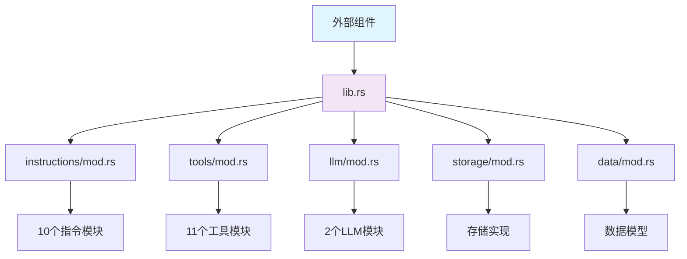

# Cowork Forge 模块聚合域技术文档

## 1. 模块概述

### 1.1 模块定义与定位
模块聚合域是 Cowork Forge 系统的架构组织层，负责通过 Rust 模块系统的 `mod.rs` 文件统一暴露各子模块接口，降低外部依赖的复杂性。该域不包含具体业务逻辑，主要作为代码组织与封装层，提升系统的模块化程度和可维护性。

### 1.2 技术架构定位
- **架构层级**: 代码组织层
- **依赖关系**: 被所有业务域依赖的基础设施层
- **核心价值**: 提供清晰的模块边界和统一的访问入口

## 2. 核心组件分析

### 2.1 核心库聚合 (`lib.rs`)
```rust
// Cowork Forge - Core Library
// Built with adk-rust 0.2.1

pub mod data;
pub mod storage;
pub mod llm;
pub mod tools;
pub mod agents;
pub mod pipeline;
pub mod instructions;

// Re-exports for convenience
pub use data::*;
pub use storage::*;
pub use llm::*;

// Version info
pub const VERSION: &str = env!("CARGO_PKG_VERSION");
```

**技术实现要点**:
- 使用 `pub mod` 声明所有核心模块
- 通过 `pub use` 重导出关键模块内容
- 提供版本信息常量
- 作为整个 `cowork-core` 库的统一入口点

### 2.2 智能体指令聚合 (`instructions/mod.rs`)
```rust
// Agent instructions - Prompt templates for each agent

pub mod idea;
pub mod prd;
pub mod design;
pub mod plan;
pub mod coding;
pub mod check;
pub mod delivery;
pub mod modify;
pub mod code_patch;
pub mod modify_delivery;

pub use idea::*;
pub use prd::*;
pub use design::*;
pub use plan::*;
pub use coding::*;
pub use check::*;
pub use delivery::*;
pub use modify::*;
pub use code_patch::*;
pub use modify_delivery::*;
```

**聚合的指令模块**:
- **idea.rs**: IdeaAgent 指令模板 (2.0KB)
- **prd.rs**: PRD Actor-Critic 指令 (8.2KB)  
- **design.rs**: Design Actor-Critic 指令 (9.3KB)
- **plan.rs**: Plan Actor-Critic 指令 (8.4KB)
- **coding.rs**: Coding Actor-Critic 指令 (9.1KB)
- **check.rs**: CheckAgent 指令 (1.5KB)
- **delivery.rs**: DeliveryAgent 指令 (3.1KB)
- **modify.rs**: Modify Triage Agent 指令 (3.2KB)
- **code_patch.rs**: Code Patch Agent 指令 (3.2KB)
- **modify_delivery.rs**: Modify Delivery Agent 指令 (2.7KB)

### 2.3 工具执行聚合 (`tools/mod.rs`)
```rust
// Tools module - adk-rust Tool implementations
pub mod data_tools;
pub mod validation_tools;
pub mod control_tools;
pub mod file_tools;
pub mod artifact_tools;
pub mod goto_stage_tool;
pub mod test_lint_tools;
pub mod hitl_tools;
pub mod hitl_content_tools;
pub mod modify_tools;
pub mod idea_tools;

pub use data_tools::*;
pub use validation_tools::*;
pub use control_tools::*;
pub use file_tools::*;
pub use artifact_tools::*;
pub use goto_stage_tool::*;
pub use test_lint_tools::*;
pub use hitl_tools::*;
pub use hitl_content_tools::*;
pub use modify_tools::*;
pub use idea_tools::*;
```

**聚合的工具模块**:
- **file_tools.rs**: 文件操作工具 (16.2KB)
- **data_tools.rs**: 数据操作工具 (33.3KB)
- **validation_tools.rs**: 验证工具 (9.0KB)
- **hitl_content_tools.rs**: HITL内容交互工具 (6.0KB)
- **hitl_tools.rs**: HITL交互工具 (9.1KB)
- **control_tools.rs**: 控制工具 (10.4KB)
- **modify_tools.rs**: 修改工具 (7.1KB)
- **artifact_tools.rs**: 产物工具 (5.8KB)
- **goto_stage_tool.rs**: 阶段跳转工具 (2.9KB)
- **idea_tools.rs**: 想法工具 (2.1KB)
- **test_lint_tools.rs**: 测试检查工具

### 2.4 LLM集成聚合 (`llm/mod.rs`)
```rust
// LLM module - Using adk-rust's built-in OpenAI client with custom base URL
pub mod config;
pub mod rate_limiter;

pub use config::*;
pub use rate_limiter::*;
```

**聚合的LLM模块**:
- **config.rs**: LLM配置管理 (3.0KB)
- **rate_limiter.rs**: 速率限制器 (1.3KB)

### 2.5 持久化存储聚合 (`storage/mod.rs`)
```rust
// Storage layer for .cowork/ directory - Session-scoped architecture
use crate::data::*;
use anyhow::{Context, Result};
use std::fs;
use std::path::{Path, PathBuf};

[cfg(test)]
mod storage_test;

const COWORK_DIR: &str = ".cowork";
const INDEX_FILE: &str = "index.json";
const SESSIONS_DIR: &str = "sessions";
```

**存储架构特点**:
- 会话级别存储隔离
- 目录结构化管理
- 支持项目索引和会话元数据

### 2.6 数据模型聚合 (`data/mod.rs`)
```rust
// Data models module
pub mod models;
pub mod schemas;

#[cfg(test)]
mod models_test;

pub use models::*;
pub use schemas::*;
```

**数据模块组成**:
- **models.rs**: 核心数据模型定义 (17.1KB)
- **schemas.rs**: 数据模式验证 (64B)

## 3. 技术架构模式

### 3.1 Facade模式应用
模块聚合域采用经典的Facade模式，为复杂的子系统提供统一的简化接口：
- **隐藏复杂性**: 外部组件无需了解内部模块结构
- **统一访问**: 通过聚合层提供一致的API入口
- **松耦合**: 降低模块间的直接依赖

### 3.2 Rust模块系统最佳实践
```rust
// 标准模块声明模式
pub mod module_name;           // 声明模块
pub use module_name::*;        // 重导出内容

// 测试模块隔离
#[cfg(test)]
mod module_test;               // 仅在测试时编译
```

### 3.3 分层聚合策略
系统采用分层聚合策略：
1. **一级聚合**: `lib.rs` 聚合所有功能域
2. **二级聚合**: 各域的 `mod.rs` 聚合内部子模块
3. **三级实现**: 具体的功能实现文件

## 4. 交互流程分析

### 4.1 外部组件访问流程
```
外部组件 → lib.rs → 对应域mod.rs → 具体实现模块
```

### 4.2 模块依赖关系


### 4.3 聚合层的作用
1. **接口统一**: 为不同功能域提供一致的访问方式
2. **依赖管理**: 控制模块间的可见性和访问权限
3. **版本控制**: 通过lib.rs管理库版本信息
4. **测试支持**: 组织测试模块的编译和运行

## 5. 技术实现细节

### 5.1 文件大小分布分析
- **指令域**: 11个文件，总大小51KB
- **工具域**: 11个文件，总大小102.6KB  
- **LLM域**: 3个文件，总大小4.5KB
- **存储域**: 1个文件，大小17.4KB
- **数据域**: 3个文件，总大小17.3KB

### 5.2 模块复杂度评估
- **低复杂度**: 聚合模块本身代码简单（100-600行）
- **高复杂度**: 聚合的具体实现模块复杂度较高
- **职责单一**: 每个聚合模块专注于特定功能域

### 5.3 错误处理策略
聚合层采用Rust标准的错误处理模式：
```rust
use anyhow::{Context, Result};  // 统一的错误类型
pub fn function() -> Result<Type> {  // 显式错误返回
    // 函数实现
}
```

## 6. 演进与扩展性

### 6.1 模块扩展机制
当需要添加新功能时：
1. 创建新的实现模块
2. 在对应的mod.rs中声明和导出
3. 外部组件通过聚合层访问新功能

### 6.2 版本兼容性
- 通过语义化版本控制管理接口变更
- 聚合层提供向后兼容的API设计
- 支持渐进式功能演进

## 7. 总结

模块聚合域作为Cowork Forge系统的架构组织核心，通过Rust模块系统的标准化设计，实现了：
- **清晰的模块边界**: 每个功能域有明确的职责范围
- **简化的外部依赖**: 外部组件只需依赖聚合层接口
- **可维护的代码结构**: 支持功能的独立开发和测试
- **良好的扩展性**: 新的功能模块可以无缝集成

该域的成功实现为整个系统的模块化架构奠定了坚实基础，是Cowork Forge能够支持复杂智能体协作流程的技术保障。