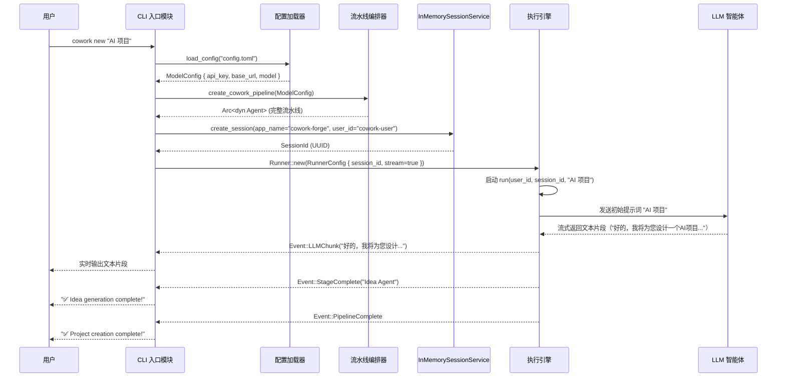

# 用户交互与入口层技术文档

## 概述

用户交互与入口层是 Cowork Forge 系统的唯一对外接口，负责接收用户指令、初始化运行环境，并将控制权安全、准确地移交至核心智能体编排引擎。该层不包含任何业务逻辑，其核心职责是作为**协调者**（Orchestrator）而非**执行者**，确保用户意图能够被精确解析、环境配置被正确加载，并通过标准化接口触发底层自动化开发流程。

本层采用命令行界面（CLI）作为唯一交互方式，基于 Rust 生态的 `clap` 库构建，具备高可靠性、低延迟和强类型安全的特性。系统完全依赖本地文件系统进行状态持久化，因此入口层还需负责验证项目上下文（如 `.cowork/` 目录是否存在），以确保流程的连续性与一致性。其设计遵循“最小权限”与“单一职责”原则，是实现“轻量、可靠、可移植”工程哲学的关键一环。

## 核心组件：CLI 入口模块

### 模块定位

- **模块名称**：CLI 入口模块
- **代码路径**：`crates/cowork-cli/src/main.rs`
- **依赖关系**：
  - **输入依赖**：用户终端（标准输入）、`config.toml` 配置文件、环境变量
  - **输出依赖**：调用 `cowork-core` 模块的 `create_cowork_pipeline()`、`create_resume_pipeline()`、`create_partial_pipeline()` 等函数
  - **状态依赖**：`.cowork/` 目录下的持久化数据（用于状态判断）
- **领域类型**：基础设施域（Infrastructure Domain）

### 命令体系与功能实现

CLI 模块通过 `clap` 库定义了五个核心子命令，每个命令对应一种用户操作场景，其行为逻辑高度结构化，确保用户操作的可预测性与系统响应的一致性。

| 子命令 | 功能描述 | 核心逻辑 | 用户场景 |
| :--- | :--- | :--- | :--- |
| `new` | 创建全新项目 | 检查当前目录下是否存在 `.cowork/` 目录。若存在，报错退出；若不存在，加载配置，调用 `create_cowork_pipeline()` 启动完整流水线 | 用户首次启动项目，从零开始构建 |
| `resume` | 恢复中断项目 | 检查 `.cowork/` 目录是否存在。若不存在，报错退出；若存在，扫描产物文件（如 `requirements.json`、`design_spec.json`）以确定恢复点，调用 `create_resume_pipeline()` 启动恢复流程 | 开发中断后，用户希望从上次中断处继续 |
| `modify` | 修改指定阶段 | 检查 `.cowork/` 目录是否存在。若不存在，报错退出；若存在，根据用户指定的目标阶段（如 `--stage prd`），调用 `create_partial_pipeline(from_stage)` 重建流水线，跳过前置阶段 | 用户希望跳过某阶段（如重新设计架构）或修正历史产物 |
| `status` | 查看当前状态 | 读取 `.cowork/data/` 目录下的 `requirements.json`、`feature_list.json`、`design_spec.json`、`implementation_plan.json` 等文件，格式化输出各阶段完成情况 | 技术负责人监控开发进度，确认当前所处阶段 |
| `init` | 初始化配置文件 | 在当前目录写入默认的 `config.toml` 文件，包含 LLM 配置模板（API Key、Base URL、模型名称） | 新用户首次使用，快速完成环境配置 |

> **关键设计原则**：所有命令均采用“先验证，后执行”的安全模式。任何对 `.cowork/` 目录状态的误判都将导致流程终止，避免污染或覆盖已有项目数据，体现了系统对**状态一致性**的极致追求。

### 配置加载机制

配置加载是入口层的关键预处理步骤，决定了系统与外部 LLM 服务的连接方式。其加载优先级遵循“显式 > 隐式 > 默认”的原则：

1. **显式配置**：若用户通过 `--config <path>` 参数指定了配置文件路径，则优先加载该文件。
2. **隐式配置**：若未指定路径，则默认加载当前工作目录下的 `config.toml`。
3. **环境变量回退**：若配置文件不存在或解析失败，系统将尝试从环境变量中读取 LLM 相关参数（如 `COWORK_LLM_API_KEY`、`COWORK_LLM_BASE_URL`）。
4. **默认值兜底**：若以上均失败，系统将使用内置的默认配置（通常为占位符），并提示用户手动配置。

配置加载成功后，系统会调用 `setup_logging()` 函数，根据用户传入的 `--verbose` 或 `--log-level` 参数设置日志级别（如 `INFO`、`DEBUG`），确保调试信息的可控性。

### 流程启动与会话管理

在完成命令解析与配置加载后，入口层通过调用 `cowork-core` 提供的 API 启动核心引擎。其核心流程如下：

1. **构建流水线**：根据命令类型调用 `create_cowork_pipeline()`（新项目）、`create_resume_pipeline()`（恢复）或 `create_partial_pipeline(from_stage)`（修改）。
2. **创建会话服务**：调用 `InMemorySessionService::new()` 创建一个内存会话实例，绑定 `app_name="cowork-forge"` 和 `user_id="cowork-user"`，用于在智能体协作过程中传递上下文。
3. **初始化 Runner**：创建 `Runner` 实例，传入 `RunnerConfig`（包含 LLM 客户端、会话 ID、是否启用流式输出等配置）。
4. **启动执行引擎**：调用 `runner.run(user_id, session_id, content)`，将控制权完全移交至 `cowork-core` 的智能体编排层。

> **重要说明**：`content` 参数为用户在 CLI 中输入的原始请求（如 `"AI 项目"`），它作为初始提示词（prompt）传递给首个智能体（Idea Agent），是整个自动化流程的起点。

### 输出与交互反馈

入口层负责将系统运行结果以用户友好的方式呈现：

- **标准输出（stdout）**：用于输出用户可见的最终结果，如 `✅ Project creation complete!`、`🚀 Starting PRD generation...` 等阶段提示。
- **标准错误（stderr）**：通过 `tracing` 日志框架输出调试信息、错误堆栈和警告，便于开发者排查问题。
- **流式输出（--stream）**：若用户启用 `--stream` 参数，入口层会订阅 `Runner` 返回的事件流（Event Stream），实时将 LLM 生成的文本片段逐块打印到终端，模拟“对话式”交互体验，提升用户感知的流畅性。

## 核心交互模式与数据流

### 交互时序图（Sequence Diagram）



### 关键交互模式

1. **命令驱动**：所有操作均通过 CLI 命令触发，无图形界面，符合开发者工具的使用习惯。
2. **状态感知**：入口层通过检查 `.cowork/` 目录的存在性与内容，动态决定启动完整流程或恢复流程，实现“状态即文件”的设计哲学。
3. **单向控制流**：入口层仅负责“启动”与“监听”，不参与智能体内部的决策、校验或反馈收集，职责边界清晰。
4. **异步非阻塞**：基于 `tokio` 异步运行时，CLI 主线程在启动 `Runner` 后即进入事件监听状态，不阻塞用户终端，支持实时流式输出。

## 技术实现细节

### 代码结构概览（`main.rs`）

```rust
// crates/cowork-cli/src/main.rs

use clap::{Parser, Subcommand};
use std::path::Path;

#[derive(Parser)]
#[command(name = "cowork")]
#[command(about = "AI 驱动的自动化软件开发系统")]
struct Cli {
    #[command(subcommand)]
    command: Commands,

    #[arg(short, long, help = "指定配置文件路径")]
    config: Option<String>,

    #[arg(short, long, help = "启用详细日志输出")]
    verbose: bool,

    #[arg(short, long, help = "实时流式输出 LLM 响应")]
    stream: bool,
}

#[derive(Subcommand)]
enum Commands {
    New {
        #[arg(help = "项目描述")]
        description: String,
    },
    Resume,
    Modify {
        #[arg(long, help = "指定恢复到的阶段")]
        stage: String,
    },
    Status,
    Init,
}

#[tokio::main]
async fn main() -> anyhow::Result<()> {
    let cli = Cli::parse();
    let config = load_config(cli.config.as_deref())?;
    setup_logging(cli.verbose)?;

    match cli.command {
        Commands::New { description } => cmd_new(description, &config, cli.stream).await?,
        Commands::Resume => cmd_resume(&config, cli.stream).await?,
        Commands::Modify { stage } => cmd_modify(&stage, &config, cli.stream).await?,
        Commands::Status => cmd_status().await?,
        Commands::Init => cmd_init().await?,
    }

    Ok(())
}
```

### 核心函数实现要点

1. **`load_config` 函数**：
   - 使用 `config` crate 读取 `toml` 文件。
   - 实现优雅降级：文件不存在 → 环境变量 → 默认值。
   - 对 `api_key` 等敏感字段进行空值校验，避免运行时崩溃。

2. **`cmd_new` 函数**：
   ```rust
   async fn cmd_new(description: String, config: &ModelConfig, stream: bool) -> anyhow::Result<()> {
       let cowork_dir = Path::new(".cowork");
       if cowork_dir.exists() {
           eprintln!("❌ 错误：检测到已存在的 .cowork 目录，请使用 'resume' 或删除后重试。");
           std::process::exit(1);
       }
       let pipeline = create_cowork_pipeline(config.clone());
       let session = InMemorySessionService::new("cowork-forge", "cowork-user");
       let runner = Runner::new(RunnerConfig {
           pipeline,
           session,
           stream,
           ..Default::default()
       });
       runner.run("cowork-user", session.id(), description).await?;
       println!("✅ Project creation complete!");
       Ok(())
   }
   ```

3. **`cmd_resume` 函数**：
   - 调用 `detect_resume_stage()`（位于 `cowork-core/src/pipeline/mod.rs`）分析 `.cowork/data/` 目录下的文件，确定恢复点（如发现 `requirements.json` 但无 `design_spec.json`，则恢复至 PRD 阶段）。
   - 构建 `create_resume_pipeline()`，该流水线会跳过已完成的阶段（Idea），从 PRD 开始。

4. **`cmd_status` 函数**：
   - 读取多个 JSON 文件（`requirements.json`, `feature_list.json` 等）。
   - 解析后格式化输出为表格或树状结构，展示“已完成”、“进行中”、“待启动”状态。

## 架构优势与设计哲学

### 优势总结

| 维度 | 优势体现 |
| :--- | :--- |
| **可靠性** | 通过“先验证后执行”机制，避免状态冲突；使用 `anyhow::Result` 统一错误传播，确保异常不被静默忽略。 |
| **可维护性** | 模块职责单一，代码结构清晰，CLI 逻辑与核心引擎完全解耦，便于独立测试与替换。 |
| **可扩展性** | 新增命令只需在 `clap` 结构体中添加子命令并实现对应 `cmd_*` 函数，无需修改核心引擎。 |
| **用户体验** | 支持流式输出、清晰的状态提示、友好的错误信息，降低用户学习成本。 |
| **轻量性** | 无外部依赖，仅依赖 `clap`、`tokio`、`config` 等轻量库，编译产物小，部署便捷。 |

### 设计哲学

1. **“入口即边界”**：入口层是系统与外部世界的唯一边界，所有外部输入（命令、配置）必须在此层被严格校验与转换，确保核心引擎的纯净性。
2. **“状态即文件”**：不依赖数据库，通过文件系统（`.cowork/`）承载项目状态，入口层通过文件存在性判断流程状态，实现“无状态服务”与“有状态持久化”的完美结合。
3. **“人机协同的起点”**：入口层虽不处理反馈，但通过 `--stream`、`--verbose` 等参数为 HITL 机制提供交互通道，是用户参与流程的“第一扇门”。
4. **“开闭原则”**：对扩展开放（新增命令），对修改封闭（核心引擎无需改动），符合 SOLID 原则。

## 实践建议与注意事项

1. **开发建议**：
   - 新增 CLI 命令时，务必在 `--help` 中提供清晰的示例。
   - 所有文件路径操作必须使用 `std::path::Path`，避免字符串拼接导致的路径穿越漏洞。
   - 日志输出应统一使用 `tracing`，避免混用 `println!` 和 `eprintln!`。

2. **运维建议**：
   - 生产环境中，建议通过环境变量而非配置文件传递 `api_key`，提高安全性。
   - 若用户误执行 `new` 命令覆盖了已有项目，系统会明确报错，这是设计特性而非缺陷。

3. **未来演进方向**：
   - 可考虑增加 `--dry-run` 参数，仅输出流程图而不执行，用于预演。
   - 可支持 `--format json` 输出 `status` 结果，便于脚本化集成。

## 总结

用户交互与入口层是 Cowork Forge 系统的“门面”与“守门人”。它以极简的 CLI 接口，实现了复杂 AI 流程的精准触发与环境初始化。其设计不追求炫技，而是以**可靠性、一致性、可预测性**为核心，为上层智能体编排层构建了一个稳定、安全、可信赖的运行环境。正是这一层的严谨设计，使得整个 AI 自动化开发系统能够在无 GUI、无数据库的极端轻量环境下，稳定、可靠地运行，真正实现了“让开发者专注于思考，而非重复劳动”的终极目标。