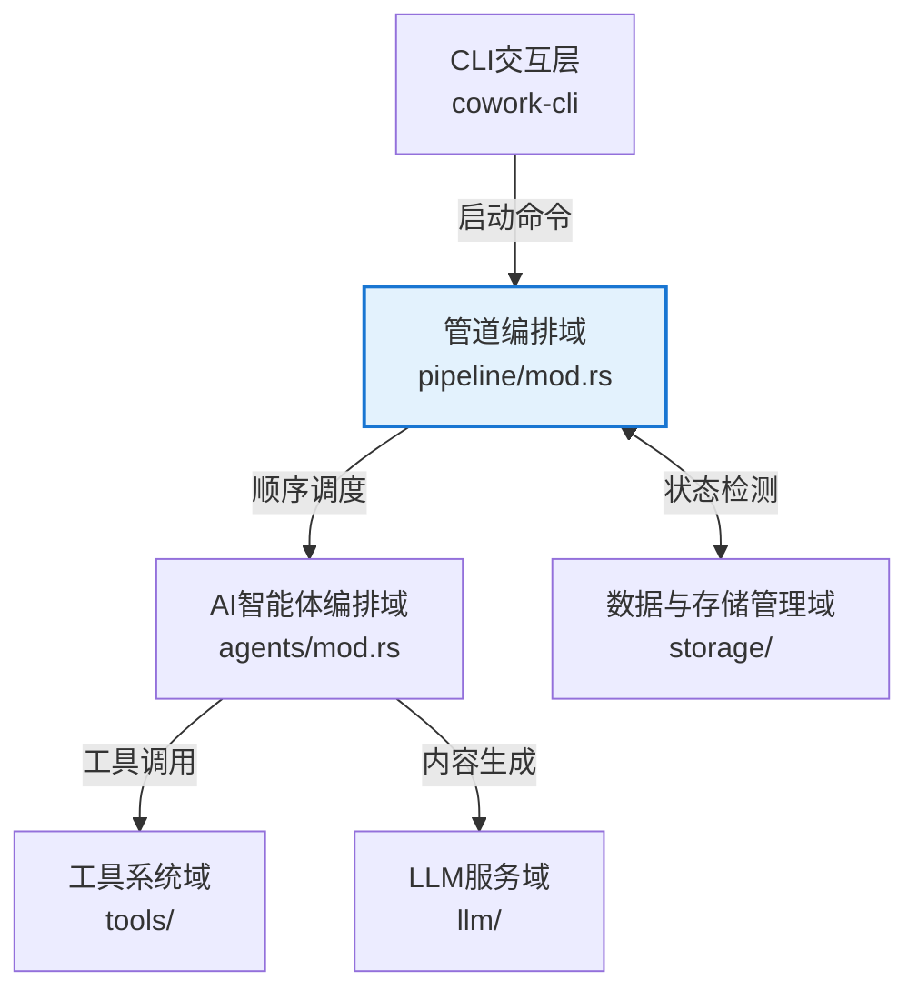
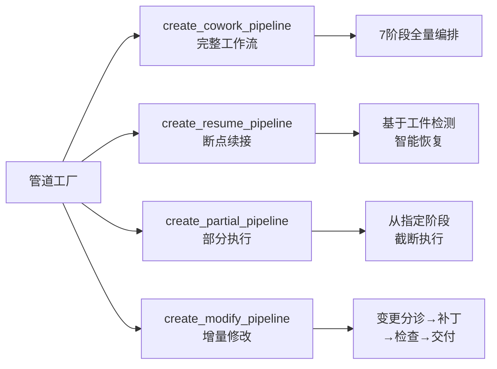
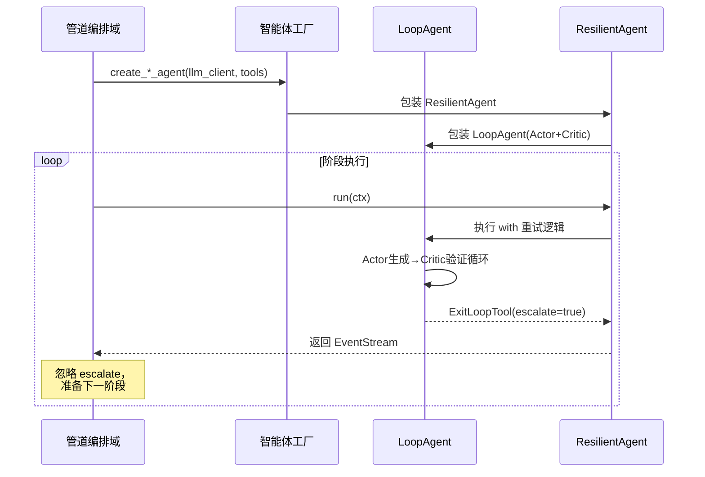

# 管道编排域技术文档

**版本**：v1.0  
**最后更新**：2024年  
**关联模块**：`crates/cowork-core/src/pipeline/mod.rs`

---

## 1. 概述

管道编排域（Pipeline Orchestration Domain）是 Cowork Forge 系统的核心工作流引擎，负责定义、构建和执行软件开发生命周期（SDLC）的各阶段流程。该领域实现了**阶段顺序执行**、**状态隔离**和**弹性恢复**三大核心能力，支持从项目创意到最终交付的端到端自动化编排。

### 1.1 核心职责

| 职责维度 | 功能描述 |
|---------|---------|
| **阶段编排** | 顺序执行 Idea → PRD → Design → Plan → Coding → Check → Delivery 七个阶段 |
| **状态隔离** | 通过 `StageExecutor` 隔离各阶段的 `escalate` 标志，确保 `ExitLoopTool` 不影响整体工作流 |
| **模式适配** | 支持完整新建、断点恢复、增量修改、版本回退四种工作模式 |
| **事件流管理** | 实现异步事件流转发，将各阶段输出实时记录到会话历史 |

### 1.2 架构定位

管道编排域位于系统核心领域层，上承 CLI 交互层（接收执行命令），下接 AI 智能体编排域（调度具体 Agent 执行），并通过存储层实现状态持久化。



---

## 2. 核心组件设计

### 2.1 StageExecutor 阶段执行器

`StageExecutor` 是实现 `Agent` trait 的阶段执行容器，区别于 ADK 框架的 `SequentialAgent`，它提供了**阶段级错误隔离**能力。

#### 2.1.1 结构设计

```rust
pub struct StageExecutor {
    /// 管道名称标识
    name: String,
    /// 命名阶段列表：(阶段名, Agent实例)
    stages: Vec<(String, Arc<dyn Agent>)>,
}
```

#### 2.1.2 关键特性

- **Escalate 隔离机制**： deliberately 忽略每个阶段返回的 `event.actions.escalate` 标志，使 `LoopAgent` 在使用 `ExitLoopTool` 退出内部循环时，不会导致整个工作流终止。
- **流式事件转发**：通过 `async_stream::stream!` 宏创建异步流，实时转发子 Agent 产生的事件到上游消费者。
- **历史记录追加**：将每个阶段的 LLM 响应内容通过 `ctx.session().append_to_history()` 追加到会话历史，实现跨阶段上下文传递。

### 2.2 管道工厂（Pipeline Factory）

采用工厂模式提供四种管道构建函数，根据业务场景组装不同的阶段序列：



---

## 3. 管道类型详解

### 3.1 完整工作流管道（create_cowork_pipeline）

构建覆盖软件开发生命周期的七阶段完整管道，适用于从零开始的新项目。

**阶段序列**：

1. **Idea Agent**：整理创意，生成 `idea.md`
2. **PRD Loop**（Actor-Critic）：需求分析与验证，生成 `prd.md`
3. **Design Loop**（Actor-Critic）：架构设计（约束 2-4 个组件），生成 `design.md`
4. **Plan Loop**（Actor-Critic）：任务规划（约束 5-12 个核心任务），生成 `plan.json`
5. **Coding Loop**（Actor-Critic）：代码实现与质量验证
6. **Check Agent**：宽容性质量检查，验证文件存在性与功能覆盖
7. **Delivery Agent**：生成交付报告，汇总需求与成果

**人机协作节点**：PRD、Design、Plan 三个阶段强制插入人工审核（HITL）。

### 3.2 断点恢复管道（create_resume_pipeline）

实现从已中断项目断点继续执行的能力，核心逻辑是**逆向工件检测**。

#### 3.2.1 恢复点检测算法

系统通过存储层 API 逆向检测各阶段产物的存在性，确定最大进度恢复点：

```rust
// 伪代码逻辑：从晚期到早期逆向检查
let start_stage = if storage.has_code_files(session_id)? {
    "check"  // 代码已完成，进入质量检查阶段
} else if storage.has_implementation_plan(session_id)? 
       && storage.has_design_spec(session_id)? {
    "coding" // 实施计划存在，从编码阶段开始
} else if storage.has_design_spec(session_id)? {
    "plan"   // 设计文档存在，从规划阶段开始
} else if storage.has_requirements(session_id)? {
    "design" // 需求文档存在，从设计阶段开始
} else {
    "prd"    // 从 PRD 阶段开始
};
```

#### 3.2.2 续接执行流程

1. 加载原会话状态（包括历史记录和上下文）
2. 基于检测到的 `start_stage` 调用 `create_partial_pipeline`
3. 跳过已完成阶段，从断点开始顺序执行后续 Agent

### 3.3 部分执行管道（create_partial_pipeline）

支持从指定阶段开始执行的灵活管道，用于**版本回退**场景。

**实现机制**：
使用 `match` 表达式基于起始阶段构建子流程：

```rust
match start_stage {
    "prd" => vec![prd_loop, design_loop, plan_loop, coding_loop, check, delivery],
    "design" => vec![design_loop, plan_loop, coding_loop, check, delivery],
    "plan" => vec![plan_loop, coding_loop, check, delivery],
    // ... 其他阶段组合
}
```

**应用场景**：
- 当用户对某阶段结果不满意时，通过 `cowork revert --to <stage>` 回退到该阶段
- 清空目标阶段及之后的工件状态，基于新会话重新执行

### 3.4 增量修改管道（create_modify_pipeline）

专为需求变更和功能增强设计的变更编排流程。

**阶段序列**：

1. **Change Triage Agent**：分析变更请求，识别影响范围（PRD/Design/Plan/Code），评估风险等级（低/中/高）
2. **SaveChangeRequestTool**：持久化变更分析结果
3. **Code Patch Agent**：基于现有代码模式执行增量修改
4. **Check Agent**：验证修改后的功能完整性和代码质量
5. **Modify Delivery Agent**：生成类 PR 描述格式的变更报告

**特点**：
- 不重新执行完整 SDLC，仅针对变更范围进行精准修改
- 支持文件指纹计算，用于变更追踪和冲突检测

---

## 4. 关键技术机制

### 4.1 异步流式执行模型

`StageExecutor::run` 方法返回 `AdkResult<EventStream>`，采用 Rust 异步流实现实时事件转发：

```rust
async fn run(&self, ctx: Arc<dyn InvocationContext>) -> AdkResult<EventStream> {
    Ok(Box::pin(stream! {
        for (stage_name, agent) in &self.stages {
            // 执行当前阶段
            let mut stage_stream = agent.run(ctx.clone()).await?;
            
            // 转发事件流
            while let Some(result) = stage_stream.next().await {
                match result {
                    Ok(event) => {
                        // 将内容追加到会话历史
                        if let Some(content) = extract_content(&event) {
                            ctx.session().append_to_history(content).await?;
                        }
                        yield Ok(event); // 向上游转发
                    }
                    Err(e) => {
                        yield Err(e); // 错误终止整个工作流
                        return;
                    }
                }
            }
        }
    }))
}
```

### 4.2 阶段隔离与 LoopAgent 协作

在 Actor-Critic 双智能体模式中，`LoopAgent` 通过 `ExitLoopTool` 退出当前循环时会设置 `escalate=true`。`StageExecutor` 通过**故意忽略**该标志，确保：

- LoopAgent 可以在当前阶段正常退出循环
- 不会传播到 `StageExecutor` 导致整个管道终止
- 下一个阶段可以正常启动执行

这种设计实现了"循环内失败不扩散"的隔离策略。

### 4.3 事件持久化与上下文传递

各阶段生成的内容通过 `append_to_history` 写入会话历史，后续阶段可通过 `ctx.session().get_history()` 访问累积上下文，实现：

- **需求追溯**：Coding 阶段可查看 PRD 阶段定义的需求
- **设计约束**：Plan 阶段可查看 Design 阶段的架构约束（2-4 组件限制）
- **变更感知**：Patch 阶段可查看 Triage 阶段分析的变更范围

---

## 5. 与周边模块的交互

### 5.1 与 AI 智能体编排域的协作



### 5.2 与存储层的交互

管道编排域通过存储层接口检测工件状态（断点恢复）和保存执行状态：

| 交互场景 | 存储接口 | 数据内容 |
|---------|---------|---------|
| 断点检测 | `has_code_files()` / `has_design_spec()` 等 | 检测各阶段产物存在性 |
| 状态隔离 | `load_session_state()` / `save_session_state()` | 会话元数据和执行状态 |
| 历史记录 | `append_to_history()` | LLM 对话历史和阶段输出 |

### 5.3 与 CLI 层的交互

CLI 层通过 ADK Runner 启动管道执行：

```rust
// CLI 层调用示例
let pipeline = create_cowork_pipeline(config, session_id);
let runner = Runner::new(RunnerConfig::default());
let result = runner.run(pipeline, ctx).await;
```

---

## 6. 实现代码示例

### 6.1 StageExecutor 核心实现

```rust
use std::sync::Arc;
use adk_core::{Agent, InvocationContext, EventStream, AdkResult};
use async_stream::stream;
use futures::StreamExt;

pub struct StageExecutor {
    name: String,
    stages: Vec<(String, Arc<dyn Agent>)>,
}

impl StageExecutor {
    pub fn new(name: impl Into<String>, stages: Vec<(String, Arc<dyn Agent>)>) -> Self {
        Self {
            name: name.into(),
            stages,
        }
    }
}

#[async_trait::async_trait]
impl Agent for StageExecutor {
    fn name(&self) -> &str {
        &self.name
    }
    
    fn description(&self) -> &str {
        "Stage-based workflow executor with escalate isolation"
    }
    
    fn sub_agents(&self) -> &[Arc<dyn Agent>] {
        &[] // 不暴露内部阶段结构
    }
    
    async fn run(&self, ctx: Arc<dyn InvocationContext>) -> AdkResult<EventStream> {
        let stages = self.stages.clone();
        
        Ok(Box::pin(stream! {
            for (stage_name, agent) in stages {
                tracing::info!(stage = %stage_name, "Executing stage");
                
                match agent.run(ctx.clone()).await {
                    Ok(mut stream) => {
                        while let Some(result) = stream.next().await {
                            match result {
                                Ok(event) => {
                                    // 关键：故意不检查 event.actions.escalate
                                    // 实现阶段隔离
                                    yield Ok(event);
                                }
                                Err(e) => {
                                    yield Err(e);
                                    return;
                                }
                            }
                        }
                    }
                    Err(e) => {
                        yield Err(e);
                        return;
                    }
                }
            }
        }))
    }
}
```

### 6.2 管道工厂实现片段

```rust
/// 创建完整工作流管道
pub fn create_cowork_pipeline(
    config: Arc<AppConfig>,
    session_id: String,
) -> Arc<dyn Agent> {
    let llm = create_llm_client(&config.llm);
    
    // 构建各阶段 Agent
    let idea_agent = create_idea_agent(llm.clone(), session_id.clone());
    let prd_loop = create_prd_loop(llm.clone(), session_id.clone());
    let design_loop = create_design_loop(llm.clone(), session_id.clone());
    let plan_loop = create_plan_loop(llm.clone(), session_id.clone());
    let coding_loop = create_coding_loop(llm.clone(), session_id.clone());
    let check_agent = create_check_agent(llm.clone(), session_id.clone());
    let delivery_agent = create_delivery_agent(llm, session_id);
    
    let stages = vec![
        ("idea".to_string(), idea_agent),
        ("prd".to_string(), prd_loop),
        ("design".to_string(), design_loop),
        ("plan".to_string(), plan_loop),
        ("coding".to_string(), coding_loop),
        ("check".to_string(), check_agent),
        ("delivery".to_string(), delivery_agent),
    ];
    
    Arc::new(StageExecutor::new("cowork_forge_pipeline", stages))
}

/// 创建断点恢复管道
pub fn create_resume_pipeline(
    config: Arc<AppConfig>,
    session_id: String,
    base_session_id: String,
) -> Arc<dyn Agent> {
    // 检测已有工件确定恢复点
    let storage = Storage::new(config.storage_path.clone());
    let start_stage = detect_resume_point(&storage, &base_session_id);
    
    // 基于恢复点创建部分管道
    create_partial_pipeline(config, session_id, start_stage)
}
```

---

## 7. 最佳实践与约束

### 7.1 阶段设计原则

1. **单一职责**：每个阶段 Agent 只关注特定 SDLC 阶段的任务（如 PRD 阶段不处理代码实现）
2. **约束显性化**：在指令模板中明确约束（如 Design 阶段限制 2-4 个组件，Plan 阶段限制 5-12 个任务）
3. **错误快速失败**：阶段内错误通过 ResilientAgent 重试，阶段间错误立即终止管道，避免无效执行

### 7.2 状态管理建议

- **工件幂等性**：各阶段 Agent 应支持重复执行（幂等设计），以便从断点恢复时不会导致数据重复
- **历史记录精简**：通过 `IncludeContents::None` 等优化手段控制上下文长度，避免超出 LLM Token 限制

### 7.3 扩展指南

新增阶段类型时：
1. 在 `agents/mod.rs` 中实现新的 Agent 工厂函数
2. 在 `pipeline/mod.rs` 的工厂函数中组装到 `stages` 向量
3. 如需断点恢复支持，在存储层添加对应的 `has_*_artifact()` 检测函数

---

## 8. 总结

管道编排域作为 Cowork Forge 的核心编排引擎，通过 `StageExecutor` 实现了**阶段隔离**、**顺序执行**和**弹性恢复**三大核心能力。其基于 Rust 异步流的实现确保了高性能的事件处理和实时反馈，四种管道工厂函数覆盖了软件开发生命周期的全场景需求（新建、恢复、修改、回退）。

该模块的设计充分考虑了 AI 工作流的特殊性（LoopAgent 循环退出、人机协作中断、上下文传递），通过精巧的 escalate 隔离机制和状态持久化策略，为上层业务提供了稳定可靠的工作流执行基座。