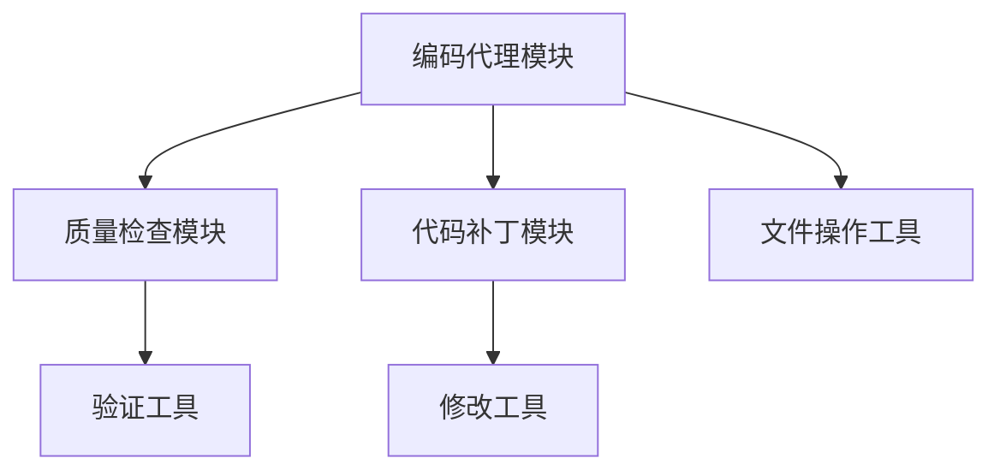
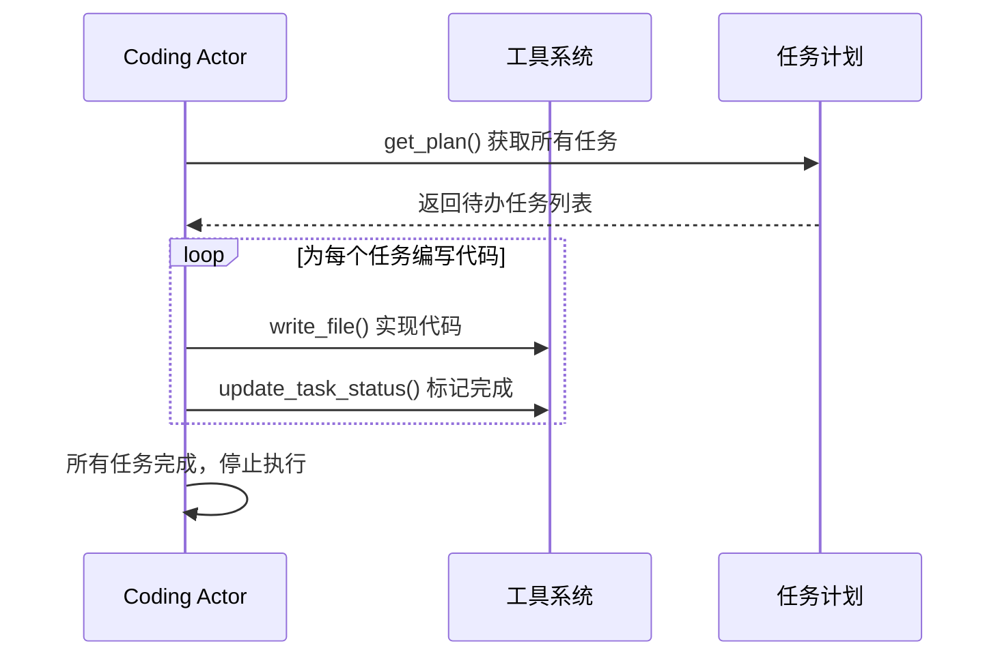
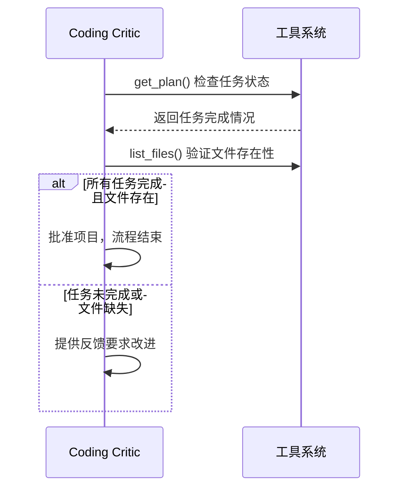
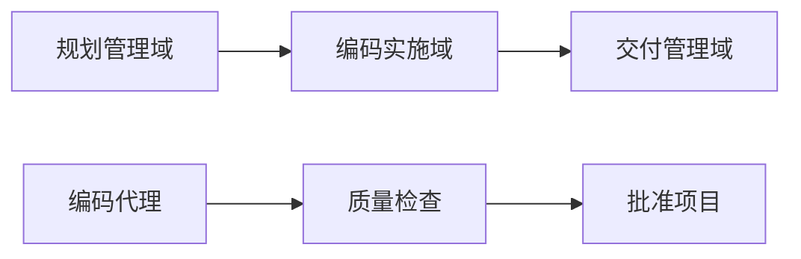

# Cowork Forge 编码实施域技术文档

## 1. 域概述

编码实施域是 Cowork Forge 系统的核心业务域之一，负责软件项目的代码实现、质量检查和增量修改功能。该域在新项目开发流程中处于第5个阶段，承接规划管理域提供的实现任务，为交付管理域提供实现的代码文件。

### 1.1 域职责定位
- **主要职责**: 代码实现、质量检查、增量修改
- **复杂度**: 9.0/10.0 (高复杂度)
- **重要性**: 9.0/10.0 (核心业务域)
- **域类型**: 核心业务域

## 2. 架构设计

### 2.1 模块组成

编码实施域包含三个核心模块，采用分层设计：



#### 2.1.1 编码代理模块 (Coding Agent)
- **文件路径**: `crates/cowork-core/src/instructions/coding.rs`
- **职责**: 代码实现和任务完成验证
- **架构模式**: Actor-Critic 双智能体协作

#### 2.1.2 代码补丁模块 (Code Patch)
- **文件路径**: `crates/cowork-core/src/instructions/code_patch.rs`
- **职责**: 增量代码修改和变更实施
- **使用场景**: 项目修改流程中的代码变更

#### 2.1.3 质量检查模块 (Check Agent)
- **文件路径**: `crates/cowork-core/src/instructions/check.rs`
- **职责**: 最小化质量验证和基础检查
- **验证原则**: 最小验证、避免过度测试

### 2.2 技术架构特点

#### 2.2.1 Actor-Critic 协作模式
```rust
// 双智能体协作架构
pub const CODING_ACTOR_INSTRUCTION: &str = "...";  // 实现所有任务
pub const CODING_CRITIC_INSTRUCTION: &str = "..."; // 验证简单性和完成度
```

#### 2.2.2 工具依赖关系
- **文件操作工具**: `file_tools.rs` - 安全文件读写
- **验证工具**: `validation_tools.rs` - 数据格式检查
- **控制工具**: `control_tools.rs` - 用户交互处理

## 3. 核心实现机制

### 3.1 编码代理实现机制

#### 3.1.1 Actor 代理工作流程


**核心原则**: 
- **简单性优先**: 避免复杂模式和过度工程化
- **一次性完成**: 实现所有任务后立即停止
- **最小依赖**: 优先使用内置功能

#### 3.1.2 Critic 代理验证流程


**验证标准**:
1. **任务完成度**: 所有任务状态为 "completed"
2. **文件存在性**: 关键代码文件已创建
3. **代码简单性**: 避免过度工程化设计

### 3.2 代码补丁机制

#### 3.2.1 增量修改策略
```rust
pub const CODE_PATCH_INSTRUCTION: &str = r#"
// 增量修改原则
1. 优先修改现有文件而非创建新文件
2. 保持修改范围最小化
3. 遵循现有代码风格和模式
4. 避免完全重写
"#;
```

#### 3.2.2 变更跟踪机制
- **元数据记录**: 自动跟踪修改的文件列表
- **会话隔离**: 修改在独立会话中进行
- **回滚支持**: 通过版本控制实现变更管理

### 3.3 质量检查机制

#### 3.3.1 最小验证原则
```rust
pub const CHECK_AGENT_INSTRUCTION: &str = r#"
// 检查原则：最小验证
- 不进行过度测试（除非项目明确要求）
- 跳过测试检查（除非测试文件存在）
- 仅进行基础结构验证
- 保持宽容态度：只要能工作就批准
"#;
```

#### 3.3.2 验证检查项
1. **功能覆盖率**: `check_feature_coverage()`
2. **任务依赖**: `check_task_dependencies()`
3. **文件存在性**: `list_files(path)`
4. **基础结构完整性**: 快速文件检查

## 4. 安全机制设计

### 4.1 文件操作安全

#### 4.1.1 路径安全验证
```rust
fn validate_path_security(path: &str) -> Result<PathBuf, String> {
    // 规则1: 拒绝绝对路径
    if path_obj.is_absolute() {
        return Err("Security: Absolute paths are not allowed");
    }
    
    // 规则2: 拒绝父目录访问
    if path.contains("..") {
        return Err("Security: Parent directory access is not allowed");
    }
    
    // 规则3: 验证路径在当前目录内
    if !canonical_path.starts_with(&current_dir) {
        return Err("Security: Path escapes current directory");
    }
}
```

#### 4.1.2 安全工具特性
- **ListFilesTool**: 安全的目录列表工具
- **路径限制**: 仅限当前工作目录内操作
- **递归深度控制**: 最大深度限制防止无限遍历

### 4.2 数据验证安全

#### 4.2.1 数据格式验证
```rust
pub struct CheckDataFormatTool {
    session_id: String,  // 会话隔离
}

impl CheckDataFormatTool {
    fn validate_requirements_schema(&self) -> Vec<String> {
        // 验证需求数据格式完整性
    }
}
```

#### 4.2.2 验证范围控制
- **数据类型枚举**: 限制可验证的数据类型
- **错误详细报告**: 提供具体的验证错误信息
- **会话隔离**: 确保数据访问的安全性

## 5. 工作流集成

### 5.1 新项目开发流程集成



### 5.2 项目修改流程集成


### 5.3 错误恢复机制

- **阶段跳转支持**: 可从编码阶段重新开始
- **HITL 介入**: 人类专家参与复杂决策
- **会话恢复**: 基于文件系统的状态持久化

## 6. 技术实现特点

### 6.1 代码生成策略

#### 6.1.1 简单性优先原则
```javascript
// ✅ 良好实践（简单直接）
function generatePaper(grade, difficulty) {
    const questions = questionBank.filter(q => 
        q.grade === grade && q.difficulty === difficulty
    );
    return questions.slice(0, 10);
}

// ❌ 不良实践（过度工程化）
class PaperGenerationStrategy {
    constructor(questionRepository, filterChain, paginationService) {...}
    async generateWithValidation() {...}
}
```

#### 6.1.2 实现约束
- **避免测试文件**: 除非明确要求，否则不生成测试代码
- **最小注释**: 仅在必要时添加注释
- **清晰结构**: 确保代码易于理解和修改

### 6.2 质量控制机制

#### 6.2.1 验证工具集成
```rust
// 验证工具调用示例
let errors = check_data_format("requirements");
if errors.is_empty() {
    // 数据格式有效，继续流程
} else {
    // 提供详细错误信息
}
```

#### 6.2.2 质量检查层级
1. **基础结构检查**: 文件存在性、目录结构
2. **数据格式验证**: JSON 架构符合性
3. **依赖关系验证**: 任务依赖无循环
4. **功能覆盖率**: 需求功能都有对应实现

## 7. 性能优化策略

### 7.1 文件操作优化
- **批量操作**: 减少不必要的文件系统调用
- **缓存机制**: 会话级别的数据缓存
- **异步处理**: 非阻塞的文件操作

### 7.2 验证效率优化
- **渐进式验证**: 按需进行验证检查
- **结果缓存**: 避免重复验证相同数据
- **并行处理**: 独立的验证任务并行执行

## 8. 扩展性设计

### 8.1 模块扩展支持
- **插件化架构**: 支持新的代码生成策略
- **工具扩展**: 可添加新的验证工具
- **指令模板**: 可定制的代理指令

### 8.2 技术栈适配
- **多语言支持**: 可扩展支持不同编程语言
- **框架适配**: 支持主流开发框架的代码生成
- **规范遵从**: 可配置的代码规范检查

## 9. 总结

编码实施域作为 Cowork Forge 系统的核心业务域，通过 Actor-Critic 双智能体协作模式，实现了高效、安全的代码生成和质量控制机制。该域的设计充分考虑了简单性、安全性和可扩展性，为软件开发团队提供了可靠的自动化编码支持。

**核心优势**:
1. **智能协作**: Actor-Critic 模式确保代码质量和完成度
2. **安全保障**: 多层次的安全机制防止系统滥用
3. **灵活扩展**: 模块化设计支持功能扩展
4. **高效执行**: 优化的文件操作和验证流程

该域的成功实现为 Cowork Forge 系统的整体目标——通过 AI 代理协作和人类监督提升软件开发效率和质量——提供了坚实的技术基础。