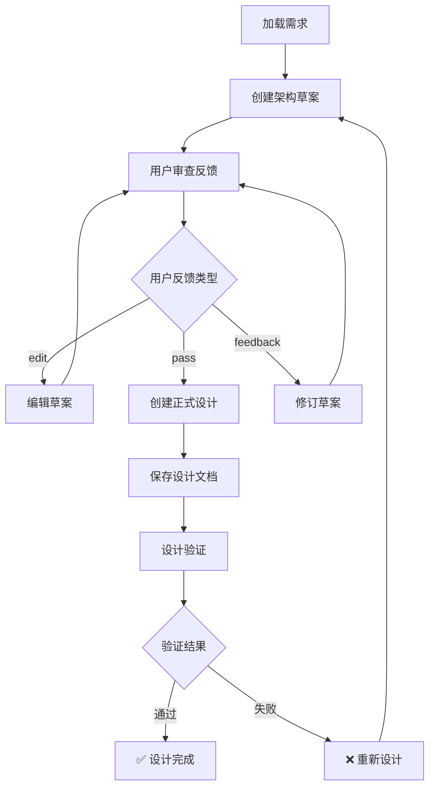

# Cowork Forge 设计管理域技术文档

## 概述

设计管理域是Cowork Forge系统的核心业务域，负责系统架构设计、技术方案制定、设计验证和架构文档管理。该模块采用Actor-Critic模式与Human-in-the-Loop（HITL）机制相结合，确保架构设计的质量和完整性。

## 核心架构组件

### 1. 设计代理模块 (Design Agent Module)

#### 1.1 设计执行者 (Design Actor)

设计执行者负责架构设计工作流的执行，包含6个强制执行步骤：

```rust
// 核心指令流程（crates/cowork-core/src/instructions/design.rs）
pub const DESIGN_ACTOR_INSTRUCTION: &str = r#"
# 您的角色
您是设计执行者。您必须基于用户反馈创建系统架构组件并保存设计文档。

# 关键步骤（所有步骤都必须执行，不可跳过）
1. 加载需求 - 调用 get_requirements() 读取所有需求和特性
2. 创建架构草案 - 编写3-6个组件的架构大纲（Markdown格式）
3. 用户评审 - 强制调用 review_with_feedback_content() 获取用户反馈
4. 创建正式设计 - 为每个组件调用 create_design_component()
5. 保存设计文档 - 生成完整的设计文档并调用 save_design_doc()
6. 验证 - 调用 get_design() 确认所有组件已创建
"#;
```

#### 1.2 设计评审者 (Design Critic)

设计评审者作为守门员，严格验证设计工件的完整性和质量：

```rust
pub const DESIGN_CRITIC_INSTRUCTION: &str = r#"
# 您的角色
您是设计评审者。必须验证设计执行者是否正确完成了所有必需步骤。

# 强制性检查（必须执行所有检查）
1. 验证设计数据存在 - 调用 get_design() 加载组件
2. 验证特性覆盖率 - 调用 check_feature_coverage() 确认所有特性都有组件映射
3. 验证工件存在 - 读取 artifacts/design.md 文件确认保存成功
4. 数据质量评估 - 检查每个组件的完整性
5. 架构完整性 - 验证所有层次覆盖和组件交互
"#;
```

### 2. Human-in-the-Loop交互工具

#### 2.1 内容评审与编辑工具

```rust
// crates/cowork-core/src/tools/hitl_content_tools.rs
pub struct ReviewAndEditContentTool;

impl Tool for ReviewAndEditContentTool {
    fn name(&self) -> &str { "review_and_edit_content" }
    
    async fn execute(&self, _ctx: Arc<dyn ToolContext>, args: Value) -> Result<Value> {
        // 显示内容预览（最多12行）
        // 提供编辑选项
        // 返回编辑后的内容或跳过
    }
}
```

#### 2.2 带反馈的内容评审工具

```rust
pub struct ReviewWithFeedbackContentTool;

impl Tool for ReviewWithFeedbackContentTool {
    fn name(&self) -> &str { "review_with_feedback_content" }
    
    async fn execute(&self, _ctx: Arc<dyn ToolContext>, args: Value) -> Result<Value> {
        let prompt = "输入 'edit' 编辑，'pass' 继续，或直接输入修改建议";
        // 支持三种操作模式：编辑、通过、反馈
    }
}
```

### 3. 验证工具模块

#### 3.1 数据格式检查工具

```rust
// crates/cowork-core/src/tools/validation_tools.rs
pub struct CheckDataFormatTool {
    session_id: String,
}

impl CheckDataFormatTool {
    fn validate_design_schema(&self) -> Vec<String> {
        match load_design_spec(&self.session_id) {
            Ok(design) => {
                if design.architecture.components.is_empty() {
                    errors.push("No components defined".to_string());
                }
            }
            Err(e) => errors.push(format!("Failed to load design: {}", e)),
        }
    }
}
```

#### 3.2 特性覆盖率检查工具

```rust
pub struct CheckFeatureCoverageTool {
    session_id: String,
}

impl Tool for CheckFeatureCoverageTool {
    async fn execute(&self, _ctx: Arc<dyn ToolContext>, _args: Value) -> Result<Value> {
        let features = load_feature_list(&self.session_id)?;
        let design = load_design_spec(&self.session_id)?;
        
        // 检查所有特性是否都有组件映射
        let uncovered: Vec<String> = features.features.iter()
            .filter(|f| !design.architecture.components.iter()
                .any(|c| c.related_features.contains(&f.id)))
            .map(|f| f.id.clone())
            .collect();
    }
}
```

## 工作流程设计

### 1. 设计创建流程

```mermaid
sequenceDiagram
    participant User as 用户
    participant Actor as Design Actor
    participant HITL as HITL工具
    participant Critic as Design Critic
    participant Storage as 数据存储
    
    Actor->>Storage: get_requirements()
    Storage-->>Actor: 返回需求和特性
    Actor->>Actor: 分析需求并规划组件
    Actor->>HITL: review_with_feedback_content()
    HITL->>User: 显示架构草案
    User->>HITL: 提供反馈
    HITL-->>Actor: 返回反馈结果
    
    loop 组件创建
        Actor->>Storage: create_design_component()
    end
    
    Actor->>Storage: save_design_doc()
    Critic->>Storage: get_design()
    Critic->>Storage: check_feature_coverage()
    Critic->>Storage: read_file(design.md)
    
    alt 验证通过
        Critic-->>User: ✅ 设计验证通过
    else 验证失败
        Critic-->>User: ❌ 设计验证失败
    end
```

### 2. 架构设计流程图



## 核心数据结构

### 设计规格定义
```rust
// 预期的数据模型结构
struct DesignSpec {
    architecture: Architecture,
    components: Vec<DesignComponent>,
    technology_stack: TechnologyStack,
}

struct DesignComponent {
    id: String,
    name: String,
    component_type: ComponentType, // frontend_component, backend_service, etc.
    responsibilities: Vec<String>,
    technology: String,
    related_features: Vec<String>,
}
```

## 技术实现特点

### 1. 强制执行的完整性检查
- **前置验证**: 在开始设计前验证需求数据完整性
- **过程验证**: 每个步骤都有明确的完成标准
- **结果验证**: 设计评审者进行全面的质量检查

### 2. 灵活的HITL交互机制
- **多种交互模式**: 支持编辑、通过、反馈三种操作
- **内容预览**: 智能截断长内容，便于用户审阅
- **编辑器集成**: 支持用户默认文本编辑器

### 3. 严格的质量控制
- **特性覆盖率检查**: 确保所有功能需求都有组件实现
- **架构完整性验证**: 验证组件层次的合理性
- **数据格式验证**: 确保存储的数据符合预期格式

## 错误处理与容错机制

### 1. 错误检测
- **空数据检测**: 检查组件数组、特性列表是否为空
- **文件存在性检查**: 验证设计文档是否成功保存
- **依赖关系验证**: 检查组件与特性的映射关系

### 2. 恢复机制
- **反馈循环**: 支持基于用户反馈的多次迭代设计
- **阶段重试**: 允许从特定阶段重新开始设计流程
- **优雅降级**: 在不满足条件时提供清晰的错误信息

## 数据持久化策略

### 1. 会话隔离存储
- 每个会话的设计数据独立存储
- 支持并发设计会话
- 完整的CRUD操作支持

### 2. 文件格式标准化
- 设计组件使用JSON格式存储
- 架构文档使用Markdown格式
- 统一的文件命名规范

## 性能优化考虑

### 1. 数据加载优化
- 按需加载设计组件
- 缓存常用的验证结果
- 增量更新设计数据

### 2. 用户交互优化
- 异步处理长时间运行的操作
- 提供进度指示和状态反馈
- 智能内容截断和预览

## 扩展性设计

### 1. 组件类型扩展
支持灵活的组件类型定义，便于集成新的技术栈和架构模式。

### 2. 验证规则扩展
模块化的验证工具架构，支持自定义验证规则的添加。

### 3. 集成接口扩展
提供标准化的接口，支持与其他业务域的深度集成。

## 总结

设计管理域通过Actor-Critic模式与HITL机制的有机结合，实现了高质量的系统架构设计自动化。该模块的严格验证机制和灵活的用户交互设计，确保了架构设计的完整性和实用性，为后续的开发阶段提供了可靠的技术基础。